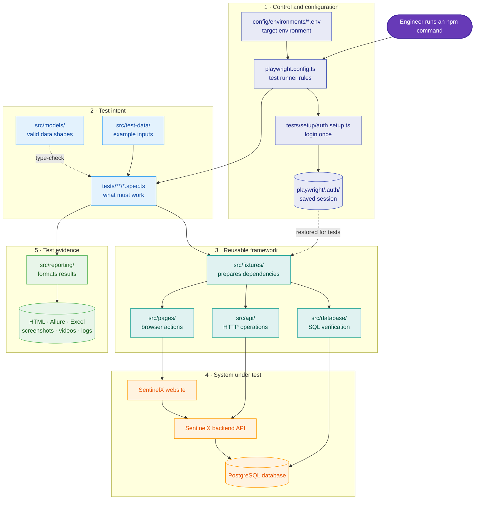
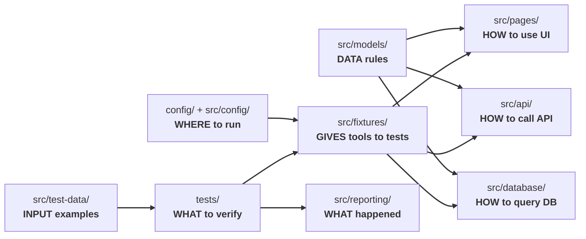
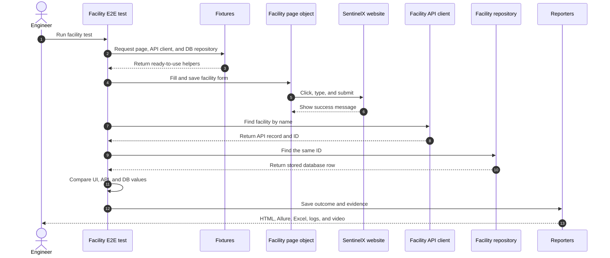
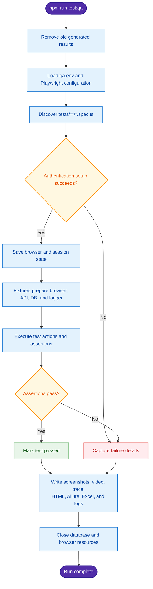

# SentinelX Quality Engineering Framework

[](https://playwright.dev/)
[](https://www.typescriptlang.org/)
[](https://www.postgresql.org/)
[](https://prettier.io/)
[](https://eslint.org/)

This repository is an automated quality-checking system for the SentinelX application. It uses **Playwright** and **TypeScript** to test three views of the same product:

- **UI tests** behave like a person using the website.
- **API tests** talk directly to the application's backend services.
- **Database tests** check what was actually stored in PostgreSQL.

You do not need to be an automation engineer to understand this guide. Think of the framework as a restaurant:

- `tests/` contains the customer orders: **what must be checked**.
- `src/pages/` contains trained waiters: **how to use the website**.
- `src/api/` is the direct phone line to the kitchen: **how to call the backend**.
- `src/database/` is the stockroom record: **how to verify saved data**.
- `src/fixtures/` is the manager who gives each test the tools it needs.
- `src/models/` describes the permitted shape of every order and record.
- `src/test-data/` contains sample orders.
- `config/` tells the team which restaurant branch—QA, development, or Deskmeet—to visit.
- `src/reporting/`, `logs/`, and report folders explain what happened after the checks ran.

## Table of contents

- [The big picture](#1-the-big-picture)
- [Complete folder map](#2-complete-folder-map)
- [Root folders explained](#3-root-folders-explained)
- [`src/` folders explained](#4-src-folders-explained-in-depth)
- [Important root files](#5-important-root-files)
- [Test execution lifecycle](#6-what-happens-when-a-test-runs)
- [Installation and first run](#7-installation-and-first-run)
- [Where new code belongs](#8-where-new-code-belongs)
- [Troubleshooting](#9-common-failures-and-the-folder-to-inspect)
- [Maintenance rules](#10-maintenance-rules-that-protect-the-structure)
- [Engineering standards](#11-engineering-standards-and-contribution-workflow)
- [Security](#12-security-and-sensitive-data)

---

## 1. The big picture

### Architecture linkage diagram



In plain English: a command starts Playwright; Playwright selects an environment and logs in; a test asks fixtures for ready-made helpers; those helpers operate the UI, API, or database; reporters then save evidence and results.

### How the main folders depend on one another



The arrows mean “uses” or “provides information to.” The key rule is that test files depend on reusable framework code; reusable framework code should not depend on individual test files.

### A real example: creating a facility

The end-to-end facility test demonstrates how the folders cooperate:

1. `tests/e2e/facility-management/facilityUiApiDb.spec.ts` states the business story: create a facility and prove it exists.
2. `src/test-data/facilities/facilities.json` supplies example names, addresses, and expected messages.
3. `src/models/ui/FacilityUiModel.ts` describes which fields valid UI facility data may contain.
4. `src/fixtures/index.ts` makes the browser, facility API client, and facility database repository available to the test.
5. `src/pages/setup/facilities/FacilityPage.ts` knows which buttons and fields to use.
6. `src/api/clients/FacilityApiClient.ts` asks the backend for the newly created facility.
7. `src/api/endpoints/FacilityEndpoints.ts` supplies the correct API route.
8. `src/database/repositories/FacilityRepository.ts` queries PostgreSQL to confirm the record.
9. `src/reporting/` records steps, logs, and test status.
10. `test-results/`, `playwright-report/`, `allure-results/`, and `logs/` hold the evidence.

This separation prevents one large test file from needing to know every selector, URL, SQL query, data shape, and reporting rule.

### Facility journey sequence



---

## 2. Complete folder map

The tree below shows the meaningful project structure. Generated files inside report folders are intentionally collapsed.

```text
quality-engineering/
├── .agents/                    # Local agent/tool instructions (development support)
├── .codex/                     # Local Codex configuration (development support)
├── .docs/                      # Internal package notes; ignored by Git
├── .idea/                      # JetBrains IDE settings; not test logic
├── .vscode/                    # VS Code workspace settings; not test logic
├── allure-results/             # Generated raw Allure result files
├── config/
│   └── environments/           # QA/dev/Deskmeet URLs and credentials
├── docs/                       # Human setup and workflow documentation
├── logs/                       # Generated date-based execution logs
├── playwright/
│   └── .auth/                  # Generated authenticated browser/session state
├── playwright-report/          # Generated Playwright HTML report
├── resources/                  # Excel test-case workbooks and report inputs
├── src/                        # Reusable automation framework code
│   ├── api/
│   │   ├── base/               # Shared HTTP behavior
│   │   ├── clients/            # Feature-specific API operations
│   │   └── endpoints/          # Feature-specific API paths
│   ├── config/                 # Code that exposes environment values
│   ├── database/
│   │   ├── connection/         # Shared PostgreSQL connection/pool
│   │   └── repositories/       # Feature-specific SQL operations
│   ├── fixtures/               # Dependency wiring for Playwright tests
│   ├── models/
│   │   ├── api/                # API request/response TypeScript shapes
│   │   ├── database/           # Database row TypeScript shapes
│   │   └── ui/                 # UI form/test-data TypeScript shapes
│   ├── pages/
│   │   ├── authentication/     # Login behavior
│   │   ├── base/               # Shared page behavior
│   │   ├── components/         # Reusable widgets such as grid/sidebar/toast
│   │   ├── dashboard/          # Dashboard behavior
│   │   └── setup/              # Feature pages: facilities, profiles, members, etc.
│   ├── reporting/
│   │   ├── allure/             # Allure metadata, steps, and attachments
│   │   ├── excel/              # Writes execution status to Excel sheets
│   │   └── logging/            # Console and file logging
│   ├── test-data/              # JSON examples, generated data, runtime inputs
│   └── utils/                  # Small reusable technical helpers
├── test-results/               # Generated artifacts, videos, traces, Monocart report
├── tests/                      # Executable test specifications
│   ├── api/                    # Backend-only tests
│   ├── e2e/                    # UI + API + database journeys
│   ├── setup/                  # Login/session preparation
│   ├── smoke/                  # Fast basic-health checks
│   └── ui/                     # Browser-only feature tests
├── trash/                      # Old/reference code; not part of normal execution
├── eslint.config.mjs           # Code-quality rules
├── package.json                # Dependencies and runnable commands
├── package-lock.json           # Exact dependency versions
├── playwright.config.ts        # Central test-runner configuration
├── prettier.config.mjs         # Automatic formatting rules
├── tsconfig.json               # TypeScript rules and @src/@tests aliases
└── README.md                   # This guide
```

---

## 3. Root folders explained

### `tests/` — the test stories

This is where Playwright looks for files ending in `.spec.ts`. Each file describes expected product behavior: “create a member,” “reject invalid facility data,” or “the service health check succeeds.”

Subfolders group tests by scope:

| Folder | What it checks | Easy example | If missing |
|---|---|---|---|
| `tests/setup/` | Logs in before protected tests and saves the session | A receptionist gives every tester a valid visitor badge | Chromium tests fail before starting or protected pages redirect to login |
| `tests/smoke/` | A small, fast set of essential checks | Check that the building has power before inspecting every room | There is no quick warning that the whole system is unavailable |
| `tests/ui/` | Website screens, forms, buttons, tables, and messages | Fill the Add Member form and check the success toast | Visual and browser interaction defects go undetected |
| `tests/api/` | Backend requests and responses without the browser | Send a create-facility request and check the HTTP response | Backend defects may be hidden behind the UI |
| `tests/e2e/` | One business journey across several layers | Create through UI, read through API, verify in DB | Each layer may pass alone while their integration is broken |

Feature folders such as `members/`, `facilities/`, `profiles/`, and `computeNodes/` keep related tests together. They mirror similarly named folders or files under `src/`, making code easier to find.

**Why this folder is needed:** it contains the actual test intent. `src/` supplies tools, but tools alone do not execute business checks.

### `src/` — the reusable automation toolbox

`src/` holds implementation details shared by tests. A test should read like a business scenario; complex clicking, request building, SQL, setup, and logging belong here.

If `src/` disappeared, most tests would fail to compile because imports such as `@src/fixtures/index` and `@src/pages/...` could not be resolved.

The next section explains every `src/` subfolder in detail.

### `config/environments/` — where tests should run

The files `qa.env`, `dev.env`, and `deskmeet.env` contain environment-specific values such as:

- website base URL;
- test membername and password;
- PostgreSQL host, port, database, membername, and password;
- browser behavior such as `HEADLESS` or `SLOW_MO` when configured.

Example: `TEST_ENV=dev` tells `playwright.config.ts` to load `config/environments/dev.env`; without `TEST_ENV`, the runner defaults to `qa`.

**Why needed:** the same test code can run against different deployments without hard-coding addresses and secrets in tests.

**If missing or incorrect:** login, navigation, API calls, or database connections fail; worse, tests could target the wrong environment. Treat these files as sensitive and do not place real production secrets in source control.

> **Current configuration note:** `playwright.config.ts` correctly reads `config/environments/<name>.env`, but `src/config/environment.ts` currently resolves `<name>.env` beside itself in `src/config/`. Authentication and database code that imports this module may therefore receive missing values unless variables were already loaded by Playwright. Keep both loaders aligned if configuration code is changed.

### `resources/` — maintained test-case documents

This currently contains Excel workbooks such as `facility_test_cases.xlsx` and `api_facility_test_cases.xlsx`. `src/reporting/excel/ExcelReporter.ts` matches a test-case ID and writes its Passed/Failed status and execution timestamp into the appropriate workbook.

Example: a test named or annotated `TC-LOC-001` can update the matching row in `facility_test_cases.xlsx`.

**Why needed:** it connects automated execution with test-management evidence useful to non-developers.

**If missing:** tests can still execute, but the Excel reporter logs that the workbook was not found, and those spreadsheets will not receive updated results.

### `docs/` — instructions for people

This folder contains detailed setup or process documents, currently including the setup guide and GitHub-to-Bitbucket member setup. The README gives orientation; `docs/` holds focused how-to guides that would make the README too long.

**If missing:** the framework may still run for an experienced maintainer, but onboarding and repeatable setup become harder.

### Generated output folders

These folders are produced during login or test execution. They are evidence, not source code:

| Folder | Contents | Can it be regenerated? | What if unavailable? |
|---|---|---:|---|
| `playwright/.auth/` | Browser cookies/local storage plus saved session storage | Yes, by the setup project | Authenticated tests fail or must log in again |
| `test-results/` | Screenshots, videos, traces, runtime JSON, Monocart HTML | Yes, by running tests | Tests run, but debugging evidence and cross-step runtime values are lost |
| `playwright-report/` | Playwright's human-readable HTML report | Yes | No Playwright dashboard for the previous run |
| `allure-results/` | Raw files used to build an Allure report | Yes | Allure cannot build the previous run's report |
| `allure-report/` | Generated Allure website, when present | Yes from `allure-results/` | No generated Allure dashboard |
| `logs/` | Date-organized execution logs from the logger | Yes on later runs | Diagnosis is harder because detailed historical messages are gone |

Most are ignored by Git because they are machine-generated, frequently change, can be large, and may contain sensitive session information. Never commit `playwright/.auth/`.

### Tool-support folders

- `.idea/` contains IntelliJ/WebStorm settings and local shelves.
- `.vscode/` contains Visual Studio Code workspace settings.
- `.agents/` and `.codex/` support local coding-agent behavior.
- `.docs/` contains internal/local package notes and is ignored by Git.

These folders are not part of Playwright's test architecture. Removing them normally does not change product-test behavior, but it may remove a developer's editor preferences, local instructions, or shelved work. Do not delete them casually.

### `trash/` — inactive reference material

This contains old or copied code that is outside Playwright's configured `tests/` path and normal source imports. It is not required for a standard run.

**Risk:** developers may accidentally copy outdated patterns from here or mistake a file for an active test. Long-term history is usually safer in version control; confirm ownership before removing this folder.

---

## 4. `src/` folders explained in depth

### `src/pages/` — website actions translated into reusable code

This is the Page Object Model layer. Page objects hide selectors and browser mechanics behind meaningful methods.

Instead of every test repeating:

```ts
await page.getByProfile('button', { name: 'Add Facility' }).click();
```

a test can call a method such as:

```ts
await facilitiesPage.clickOnAddFacility();
```

Its subfolders have distinct jobs:

- `authentication/`: login fields, submit action, and login flow.
- `base/`: behavior common to many pages.
- `components/`: widgets reused across pages—`Sidebar`, `DataGrid`, `Pagination`, `PermissionGrid`, `Toast`, and general `Common` actions.
- `dashboard/`: dashboard-specific behavior.
- `setup/`: feature page objects for event definitions, GPU nodes, facilities, profiles, and members.

**Connection:** `tests/ui/` and `tests/e2e/` use page objects, while page objects use Playwright's `Page` and model types.

**Why needed:** when a button locator changes, it is fixed once in the page object rather than in dozens of tests.

**If missing:** UI tests either fail to compile or duplicate fragile selectors everywhere. Maintenance cost and inconsistency increase sharply.

### `src/api/` — backend communication

This layer organizes REST calls:

- `base/BaseApiClient.ts` contains behavior shared by API clients.
- `endpoints/` stores route definitions such as facility, profile, member, and GPU-node paths.
- `clients/` implements feature actions such as create, read, update, and delete.
- `ApiClients.ts` collects all feature clients into one object.

Analogy: an endpoint is a phone number; a client knows what to say when the call is answered; `ApiClients` is the contact list.

**Connection:** `src/fixtures/api.fixture.ts` creates `ApiClients` using Playwright's request context, then feature fixtures expose the appropriate client to tests.

**If endpoints are missing:** requests use no route or the wrong route. **If a client is missing:** tests must build raw HTTP calls repeatedly. **If all of `api/` is missing:** API and cross-layer E2E tests fail.

### `src/database/` — direct data verification

This layer has three parts:

- `connection/DatabaseClient.ts` manages the shared PostgreSQL connection pool.
- `repositories/` contains feature-focused SQL operations.
- `DbRepositories.ts` collects repository instances and provides a common close operation.

Analogy: `DatabaseClient` opens the secured archive room; each repository is a clerk who knows which cabinet and record to inspect.

**Connection:** the base fixture creates `DbRepositories`, feature fixtures expose one repository, and tests use it for assertions or cleanup. Database model files describe returned rows.

**Why needed:** an API success message does not prove that correct data was stored. A repository provides independent verification.

**If missing:** database assertions and cleanup fail. If connections are not closed, test workers can hang or exhaust database connections.

### `src/fixtures/` — dependency wiring and lifecycle

Fixtures prepare tools before a test and clean them up afterward. They are similar to a furnished workbench: the test asks for `page`, `facilityApiClient`, or `facilityRepository`, and receives a ready-to-use instance.

- `baseFixture.ts` adds automatic logging, database lifecycle management, authenticated session restoration, and browser/network diagnostics.
- `api.fixture.ts` creates the combined API client object.
- Feature fixtures such as `facility.fixture.ts`, `member.fixture.ts`, `profile.fixture.ts`, and `computeNode.fixture.ts` expose focused clients and repositories.
- `index.ts` merges the fixtures and exports the standard `test` and `expect` used by most suites.

Example:

```ts
test('facility exists', async ({ facilityApiClient, facilityRepository }) => {
    // Both helpers were constructed by fixtures before this body started.
});
```

**Why needed:** it centralizes setup, cleanup, sharing, and dependency construction.

**If missing:** tests fail on fixture imports or each test must manually create and dispose browsers, API contexts, and DB connections. Missing authentication restoration causes protected-page failures.

### `src/models/` — agreed data shapes

Models are TypeScript contracts. They document and compile-check what fields are expected at each boundary:

- `models/ui/`: values used in forms and visible UI behavior;
- `models/api/`: request payloads and response objects;
- `models/database/`: PostgreSQL row shapes.

One facility may have related but different names in each layer—for example, the UI might use `facilityName`, the API might return `name`, and the database might expose a column mapped as `name`. Separate models make these boundaries explicit.

**Why needed:** TypeScript catches missing fields, incorrect types, and incorrect assumptions before the test runs.

**If missing:** code may still run if rewritten with loose types, but mistakes shift from fast compile-time errors to slower and less obvious runtime failures.

### `src/test-data/` — repeatable examples and generated values

JSON files group sample data by feature: streams/regions, GPU nodes, facilities, profiles, and members. `TestDataFactory.ts` uses Faker to generate unique names or emails when fixed values would collide.

Analogy: models are blank official forms; test-data files are example completed forms.

**Connection:** tests import JSON data, page objects use it to fill forms, and API clients may send it as request payloads. Models check that the data has the expected shape.

**If missing:** tests have no shared input and either fail imports or hard-code values repeatedly. Fixed shared data can also cause duplicate-record failures when tests run again.

### `src/reporting/` — results and diagnostic evidence

- `allure/AllureUtil.ts` adds business metadata, steps, and failure attachments.
- `excel/ExcelReporter.ts` updates matching test-case rows in `resources/`.
- `logging/Logger.ts` writes readable terminal and rotating file logs.

**Connection:** tests call Allure and Logger helpers; `playwright.config.ts` registers Allure and Excel reporters; generated data lands in output folders.

**If missing:** core assertions may still run, but imports or configured reporters can fail, and teams lose evidence needed to understand failures and report quality status.

### `src/config/` — configuration access in code

`environment.ts` turns environment variables into a simple `config` object containing the website, login, database, and creator settings.

Example: the authentication setup reads `config.membername` and `config.password`; database code reads the DB fields.

**Why needed:** callers do not repeatedly parse environment variables.

**If missing:** login and database modules fail their imports. If values are undefined, failures may appear later as confusing authentication or connection errors.

### `src/utils/` — narrow shared helpers

`JsonDataUtil.ts` saves temporary values in `test-results/runtime-data.json`. For example, an E2E create test saves a new facility ID so later view, edit, and delete tests can use the exact same record.

**Why needed:** it avoids copying small technical operations into test files.

**If missing:** any importing test fails; multi-step serial flows may lose the ID or name created in an earlier step.

---

## 5. Important root files

| File | Purpose | If missing or damaged |
|---|---|---|
| `package.json` | Names dependencies and commands such as `npm test` | npm does not know what to install or run |
| `package-lock.json` | Locks exact dependency versions for repeatable installs | different machines may install slightly different packages |
| `playwright.config.ts` | Defines test facility, timeouts, browsers, login dependency, reporters, artifacts, retries, and selected environment | Playwright loses the project's execution rules; setup/reporting may not run correctly |
| `tsconfig.json` | Enables strict TypeScript checks and aliases such as `@src/*` | type checking and aliased imports fail |
| `eslint.config.mjs` | Detects unsafe or inconsistent code | preventable code-quality defects are easier to introduce |
| `prettier.config.mjs` | Keeps formatting consistent | behavior is unchanged, but reviews become noisier |
| `.gitignore` | Keeps dependencies, secrets, logs, and generated reports out of Git | the repository may accidentally collect huge artifacts or authentication data |
| `README.md` | Explains the architecture and normal workflow | onboarding becomes dependent on verbal knowledge |

---

## 6. What happens when a test runs

Suppose you run:

```bash
npm run test:qa
```

The sequence is:

1. npm runs `clean:results`, removing old generated results.
2. npm sets `TEST_ENV=qa` and starts Playwright.
3. `playwright.config.ts` loads `config/environments/qa.env`.
4. Playwright discovers `.spec.ts` files under `tests/`.
5. The `setup` project runs `tests/setup/auth.setup.ts` first.
6. The login page object signs in and saves authentication under `playwright/.auth/`.
7. The `Chromium` project starts and restores that authentication.
8. Tests imported from `src/fixtures/index.ts` receive automatic logging, browser diagnostics, API clients, and DB repositories.
9. The test performs its UI/API/DB actions and assertions.
10. Playwright saves screenshots, video, trace, HTML, Allure, Monocart, Excel status, and logs according to configuration.
11. Database resources are closed after the worker completes.

### Execution lifecycle diagram



The most common dependency chain is:

```text
test specification
  -> merged fixture
      -> page object -> shared component -> website
      -> API client -> endpoint -> backend
      -> DB repository -> DB connection -> PostgreSQL
  -> models and test data
  -> reporters and generated evidence
```

---

## 7. Installation and first run

### Prerequisites

- Node.js and npm compatible with the locked dependencies
- access to the selected SentinelX environment
- valid test credentials
- database/network access for suites that query PostgreSQL

Install packages and the Chromium browser:

```bash
npm install
npx playwright install chromium
```

Confirm the required values in the appropriate file under `config/environments/`. Do not share credentials in tickets, screenshots, reports, or commits.

Useful commands:

```bash
npm run test:list       # Show discovered tests without executing them
npm run test:qa         # Run against QA
npm run test:dev        # Run against development
npm run test:deskmeet   # Run against Deskmeet
npm run test:smoke      # Run tests tagged @smoke
npm run test:headed     # Run with a visible browser
npm run test:debug      # Open Playwright debugging mode
npm run test:ui         # Open Playwright's interactive UI
npm run test:lastfailed # Re-run the previous failures
npm run typecheck       # Check TypeScript without creating JS files
npm run lint            # Run code-quality checks
npm run format:check    # Check formatting
npm run report          # Open the Playwright HTML report
npm run allure:serve    # Build and serve Allure from raw results
```

Run one folder or one tagged group:

```bash
npx playwright test tests/ui/facilities
npx playwright test --grep "@Facility"
```

---

## 8. Where new code belongs

When adding a new feature—for example, **Devices**—use this decision guide:

| Need | Correct facility | Example |
|---|---|---|
| Browser actions/selectors | `src/pages/setup/devices/` | `DevicePage.ts` |
| Shared widget used by many pages | `src/pages/components/` | `DevicePicker.ts` only if truly shared |
| API routes | `src/api/endpoints/` | `DeviceEndpoints.ts` |
| API CRUD behavior | `src/api/clients/` | `DeviceApiClient.ts` |
| SQL checks or cleanup | `src/database/repositories/` | `DeviceRepository.ts` |
| Typed data contracts | `src/models/ui`, `api`, or `database` | `DeviceUiModel.ts` |
| Sample payloads | `src/test-data/devices/` | `devices.json` |
| Dependency injection | `src/fixtures/` | `device.fixture.ts` and merge it in `index.ts` |
| Browser tests | `tests/ui/devices/` | `createDevice.spec.ts` |
| Backend tests | `tests/api/devices/` | `createDevice.spec.ts` |
| Cross-layer journey | `tests/e2e/device-management/` | `deviceUiApiDb.spec.ts` |

Also register a new API client in `ApiClients.ts`, a new repository in `DbRepositories.ts`, and any new reporter workbook under `resources/` if Excel tracking is required.

A useful rule is: **tests say what should happen; `src/` knows how to make it happen.**

---

## 9. Common failures and the folder to inspect

| Symptom | Inspect first | Likely explanation |
|---|---|---|
| Every protected UI test redirects to login | `tests/setup/`, `playwright/.auth/`, `src/config/` | setup failed, credentials are absent, or saved session is stale |
| `BASE_URL`, membername, or DB value is undefined | `config/environments/`, `src/config/environment.ts` | wrong environment selected or configuration loaders point to different facilities |
| A button cannot be found | `src/pages/` | locator changed or wrong page was opened |
| Many tests fail on the same grid/toast/sidebar | `src/pages/components/` | shared component behavior changed |
| API returns 404 | `src/api/endpoints/` | route is incorrect or unavailable in that environment |
| API payload/type problem | `src/api/clients/`, `src/models/api/`, `src/test-data/` | request construction and contract disagree |
| Database connection error | `src/database/connection/`, environment file | host, credentials, network access, or pool configuration problem |
| UI succeeds but DB assertion fails | `src/database/repositories/`, database models | wrong query, eventual delay, or real persistence defect |
| A fixture name is unknown | `src/fixtures/` | feature fixture was not created or merged in `index.ts` |
| Excel status does not update | `src/reporting/excel/`, `resources/` | test-case ID or workbook/row is missing |
| No screenshots/video/trace | `playwright.config.ts`, `test-results/` | artifact setting or output path changed |
| `@src/...` import fails | `tsconfig.json` | alias configuration is absent or the file path/capitalization is wrong |

On Linux, folder and file capitalization matters. `Dashboard/` and `dashboard/` would be different directories. Use the exact casing already present in imports and the filesystem.

---

## 10. Maintenance rules that protect the structure

1. Keep business assertions in `tests/`; keep reusable mechanics in `src/`.
2. Reuse a component or page object instead of copying selectors into tests.
3. Keep API paths in `endpoints/`, HTTP behavior in `clients/`, and SQL in `repositories/`.
4. Add or update the relevant UI/API/database model when a contract changes.
5. Use unique or generated test data so repeat runs do not collide.
6. Clean up records created by tests, preferably in `finally` or a teardown hook.
7. Import the merged `test` from `@src/fixtures/index` when custom fixtures are required.
8. Never commit authentication state, real secrets, logs, videos, traces, or generated reports.
9. Run `npm run typecheck`, `npm run lint`, and the relevant test subset before submitting changes.
10. Update this README whenever folders are added, renamed, or given a different responsibility.

The folder structure is not decoration. It is the map that lets a growing test suite stay understandable: one place for test intent, one for browser behavior, one for API behavior, one for database behavior, and clear bridges between them.

---

## 11. Engineering standards and contribution workflow

This repository follows a layered test-automation design: test intent, test data, UI actions, API operations, database access, and reporting have separate responsibilities. Changes should preserve those boundaries.

### Definition of done

A change is ready for review when:

- code is placed in the correct architectural layer;
- new behavior has an appropriate UI, API, smoke, or E2E test;
- selectors, endpoints, SQL, data, and models are not duplicated across tests;
- created test records are cleaned up safely;
- no credentials or generated authentication files are included;
- TypeScript, ESLint, and Prettier checks pass;
- the smallest relevant test suite passes;
- documentation is updated when behavior, commands, or structure changes.

Recommended local quality gate:

```bash
npm run typecheck
npm run lint
npm run format:check
npx playwright test <relevant-test-path>
```

### Suggested change workflow

1. Create a focused branch for one feature or fix.
2. Add or update reusable code in `src/`.
3. Add or update executable specifications in `tests/`.
4. Run the local quality gate and inspect the generated report.
5. Submit a review explaining the purpose, affected layers, test evidence, and configuration impact.
6. Keep commits focused; do not mix generated reports or unrelated formatting changes with functional work.

### Naming conventions

- Test files: `<action><Feature>.spec.ts`, for example `createFacility.spec.ts`.
- Page objects: `<Feature>Page.ts`.
- API clients: `<Feature>ApiClient.ts`.
- API routes: `<Feature>Endpoints.ts`.
- Repositories: `<Feature>Repository.ts`.
- Models: `<Feature><Layer>Model.ts`, such as `FacilityApiModel.ts`.
- Fixtures: `<feature>.fixture.ts`.
- Test IDs: use the agreed module pattern, such as `TC-LOC-001` or `TC-LOC-API-001`, when Excel reporting is required.

---

## 12. Security and sensitive data

- Use dedicated non-production automation accounts with the minimum permissions required.
- Never commit passwords, database credentials, API tokens, or files under `playwright/.auth/`.
- Treat screenshots, videos, traces, logs, Excel sheets, and runtime JSON as potentially sensitive.
- Keep environment-specific secrets outside source control or use the organization's approved secret manager in CI.
- Do not run destructive tests against production.
- Review logs and report attachments before sharing them outside the engineering team.
- Rotate credentials immediately if authentication state or environment files are exposed.

For detailed workstation setup, see [`docs/setup-guide.md`](docs/setup-guide.md). For repository migration and member setup, see [`docs/github-to-bitbucket-membersetup.md`](docs/github-to-bitbucket-membersetup.md).

For a complete new-module walkthrough, see [Adding the Events Module](docs/adding-events-module.md).

For optional Jira custom Test synchronization, see [Jira Test Case Integration](docs/jira-test-case-integration.md).

For safe Excel-to-Jira payload previews, see [Jira Bulk Test Case Import Preview](docs/jira-bulk-test-case-import.md).

For a simple Excel-to-Jira-to-Playwright walkthrough, see [Jira Test Integration Quick Start](docs/jira/QUICK-START.md).

For the complete detailed workflow from manual test design through Jira execution evidence, see [Jira Test Management and Playwright Integration](docs/jira/README.md).

---

## Ownership and support

The repository metadata identifies the **Quality Engineering Team** as the maintainer. Report framework defects through the repository issue tracker and include the failing command, selected environment, relevant logs, and report evidence. Never attach secrets or saved authentication files.

## License

The package metadata currently declares the project under the **ISC License**. Add a root `LICENSE` file if this repository is intended for redistribution outside the organization.
# playwrightframework
