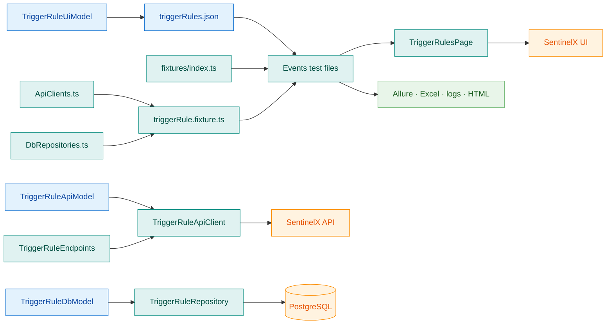
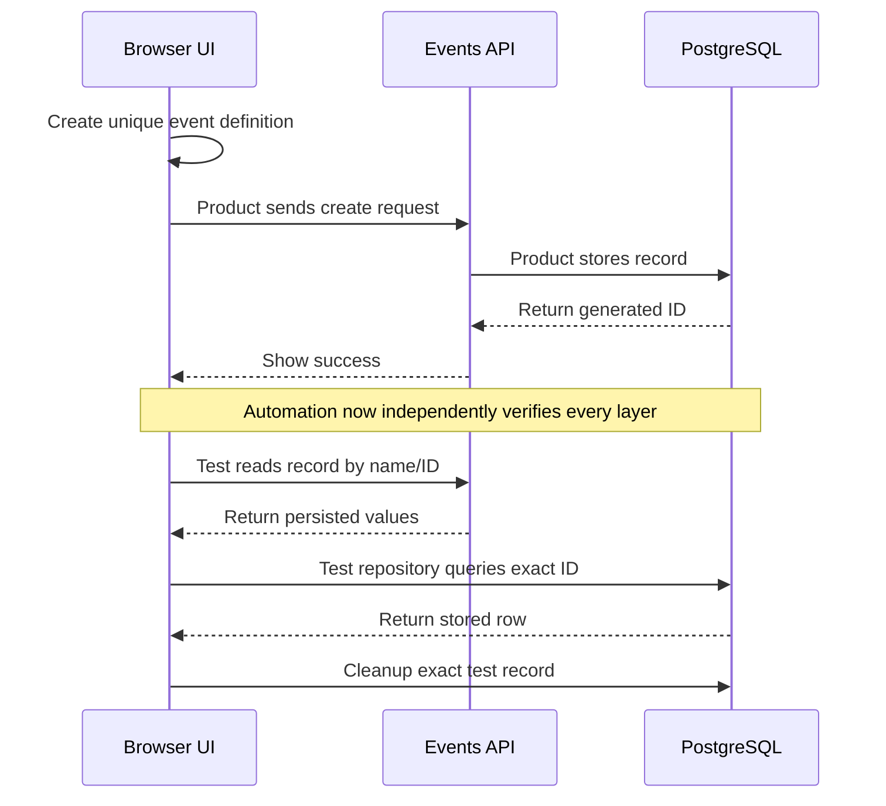

# Adding the Events Module: Step-by-Step Engineering Guide

This guide explains how to add complete automation coverage for the **Events / Event Definitions** module. It is written for an engineer who is new to this framework.

> **Scope assumption:** the application currently calls the setup screen **Event Definitions**, so this guide uses `TriggerRule` for code names and `trigger-rules` for folders. If “Events” is a different runtime-events screen, first replace the names and paths in the plan below with that module's actual product terminology. Do not combine two different product modules in one set of classes.

## Current starting point

The repository already has:

- `src/pages/setup/trigger-rules/TriggerRulesPage.ts` — opens the Event Definitions screen and Add dialog;
- `tests/ui/trigger-rules/triggerRules.spec.ts` — logs test metadata and navigates to the screen.

The existing UI test does **not** yet create or validate an event definition. The following pieces still need to be designed and added:

```text
src/models/ui/TriggerRuleUiModel.ts
src/models/api/TriggerRuleApiModel.ts
src/models/database/TriggerRuleDbModel.ts
src/test-data/trigger-rules/triggerRules.json
src/api/endpoints/TriggerRuleEndpoints.ts
src/api/clients/TriggerRuleApiClient.ts
src/database/repositories/TriggerRuleRepository.ts
src/fixtures/triggerRule.fixture.ts
tests/ui/trigger-rules/createTriggerRule.spec.ts
tests/ui/trigger-rules/editTriggerRule.spec.ts
tests/ui/trigger-rules/deleteTriggerRule.spec.ts
tests/ui/trigger-rules/triggerRuleNegative.spec.ts
tests/api/trigger-rules/createTriggerRule.spec.ts
tests/api/trigger-rules/readTriggerRule.spec.ts
tests/api/trigger-rules/updateTriggerRule.spec.ts
tests/api/trigger-rules/deleteTriggerRule.spec.ts
tests/e2e/trigger-rule-management/triggerRuleUiApiDb.spec.ts
resources/event_test_cases.xlsx                 # Only if Excel tracking is required
```

## How the new module will connect



Build from the bottom upward: understand the product contract, define data shapes, implement reusable helpers, wire fixtures, and only then write complete tests.

---

## Phase 1 — Discover the module before coding

Do not guess field names, API paths, response formats, or database tables. Collect the following facts first.

### Step 1: Document the business behavior

Meet the product owner/developer or inspect the accepted requirements. Record:

- what an event definition represents;
- required and optional form fields;
- allowed values and validation rules;
- uniqueness rules, for example whether the name must be unique;
- create, view, edit, activate/deactivate, and delete behavior;
- profiles and permissions allowed to use the module;
- exact success and error messages;
- dependencies on streams, facilities, regions, or other records.

Create a small coverage table before automating:

| Area | Minimum scenarios |
|---|---|
| Navigation | Authorized member can open Event Definitions |
| Create | Valid required fields; all fields; duplicate name |
| Validation | Empty required fields; length boundaries; invalid combinations |
| Read/Search | New record appears; search and details are correct |
| Edit | Editable fields persist; cancel leaves data unchanged |
| Delete/Deactivate | Confirmation works; cancel works; record becomes inactive |
| Permissions | Allowed profile succeeds; restricted profile is blocked |
| Integration | UI change is visible through API and PostgreSQL |

### Step 2: Capture the UI contract

Open the Event Definitions form manually and record:

- accessible labels for every input;
- button names;
- dropdown and multi-select behavior;
- grid column names;
- toast text;
- confirmation dialog text;
- stable profiles or test IDs available for locators.

Prefer locators in this order:

1. `getByProfile()` with an accessible name;
2. `getByLabel()`;
3. `getByPlaceholder()`;
4. a stable `data-testid` agreed with developers;
5. CSS only when no member-facing locator is available.

Avoid XPath, positional selectors, and generated CSS class names.

### Step 3: Capture the API contract

Use the browser Network panel or approved API documentation to record:

| Operation | Method | Path | Request body | Expected status |
|---|---|---|---|---|
| Create | `POST` | Confirm actual path | Confirm fields | Confirm status |
| List | `GET` | Confirm actual path | None/query params | `200` expected |
| Read one | `GET` | Confirm ID path | None | `200` expected |
| Update | `PATCH` or `PUT` | Confirm ID path | Confirm changed fields | Confirm status |
| Delete/deactivate | `DELETE` or `PATCH` | Confirm ID path | Confirm audit fields | Confirm status |

Save representative success and failure responses. Identify whether API names use snake case, such as `event_name`, while TypeScript code uses camel case, such as `eventName`.

### Step 4: Capture the database contract

With approved read access, confirm:

- schema and table name;
- primary key;
- column names and types;
- active/deleted flag behavior;
- created/updated audit fields;
- relationship tables and foreign keys;
- safe cleanup strategy.

Never invent a table name. Never use an unrestricted `DELETE` or `UPDATE`; every modifying query must target an exact test record by its validated ID.

### Phase 1 completion check

Continue only when the UI fields, API operations, database mapping, cleanup behavior, and test-case list are known.

---

## Phase 2 — Create the data contracts

### Step 5: Add the UI model

Create `src/models/ui/TriggerRuleUiModel.ts`. It describes data as the form and test understand it.

```ts
export interface TriggerRuleFormData {
    eventName: string;
    description: string;
    // Replace these examples with the confirmed product fields.
    eventType: string;
    severity: string;
    verifyToastMessage: string;
}
```

Why first? Page-object methods and JSON test data can now use one checked contract instead of unrelated loose objects.

### Step 6: Add the API model and validation

Create `src/models/api/TriggerRuleApiModel.ts` with:

- the raw API item shape using actual response field names;
- the normalized item returned to tests;
- list and single-response shapes;
- AJV schemas for runtime response validation;
- compiled validators exported for the client.

Follow `src/models/api/FacilityApiModel.ts`, but copy its **pattern**, not its facility fields. Required AJV fields must match the observed API contract.

### Step 7: Add the database model

Create `src/models/database/TriggerRuleDbModel.ts`.

```ts
export interface TriggerRuleDbRow {
    id: number;
    name: string;
    description: string | null;
    isActive: boolean;
    // Add only confirmed selected columns.
}
```

This interface must match aliases returned by the repository query, not necessarily raw snake-case database column names.

### Step 8: Add test data

Create `src/test-data/trigger-rules/triggerRules.json`.

```json
{
    "validTriggerRule": {
        "eventName": "Automation Event",
        "description": "Created by Playwright automation",
        "eventType": "REPLACE_WITH_VALID_TYPE",
        "severity": "REPLACE_WITH_VALID_SEVERITY",
        "verifyToastMessage": "REPLACE_WITH_ACTUAL_SUCCESS_MESSAGE"
    },
    "validation": {
        "requiredFieldMessage": "REPLACE_WITH_ACTUAL_MESSAGE"
    }
}
```

Replace every placeholder after discovery. Generate a unique name inside tests—for example with a timestamp, worker index, or `TestDataFactory`—so parallel and repeated runs do not collide.

### Phase 2 completion check

Run:

```bash
npm run typecheck
npm run format:check
```

At this point no test needs to pass, but all newly imported data contracts should compile.

---

## Phase 3 — Complete the UI page object

### Step 9: Extend `TriggerRulesPage.ts`

Keep selectors private and expose business-readable methods. The page object should eventually support:

```ts
async navigateToTriggerRules(): Promise<void>;
async clickOnAddTriggerRule(): Promise<void>;
async fillTriggerRuleForm(data: TriggerRuleFormData): Promise<void>;
async save(): Promise<void>;
async searchByName(name: string): Promise<void>;
async openDetails(name: string): Promise<void>;
async editByName(name: string): Promise<void>;
async deleteByName(name: string): Promise<void>;
async expectSuccessToast(message: string): Promise<void>;
```

Reuse `Common`, `DataGrid`, `Toast`, `Sidebar`, and other components when they already implement the interaction. Do not recreate common Save, search, grid, or toast logic in this page.

Recommended helper for create flows:

```ts
export async function createTriggerRuleThroughUi(
    page: Page,
    triggerRuleApiClient: TriggerRuleApiClient,
    data: TriggerRuleFormData,
): Promise<TriggerRuleApiItem> {
    const eventPage = new TriggerRulesPage(page);
    await page.goto('/dashboard');
    await eventPage.navigateToTriggerRules();
    await eventPage.clickOnAddTriggerRule();
    await eventPage.fillTriggerRuleForm(data);
    await eventPage.save();
    await eventPage.expectSuccessToast(data.verifyToastMessage);
    return triggerRuleApiClient.getTriggerRuleByName(data.eventName);
}
```

This lets the UI create a record and the API reliably resolve its ID for later validation and cleanup.

### Step 10: Replace the navigation-only test

Rename or split `tests/ui/trigger-rules/triggerRules.spec.ts` into intent-focused files:

- `createTriggerRule.spec.ts`;
- `editTriggerRule.spec.ts`;
- `deleteTriggerRule.spec.ts`;
- `triggerRuleNegative.spec.ts`.

Do not keep two tests that cover the same navigation-only scenario unless it is intentionally a separate smoke check.

### Phase 3 completion check

Run the UI folder visibly while developing:

```bash
npx playwright test tests/ui/trigger-rules --headed
```

Confirm locators are stable, assertions prove outcomes, and screenshots/traces contain no unexpected sensitive data.

---

## Phase 4 — Build the API layer

### Step 11: Add centralized endpoints

Create `src/api/endpoints/TriggerRuleEndpoints.ts` only after confirming actual paths:

```ts
export const TriggerRuleEndpoints = {
    CREATE: '/REPLACE_WITH_CONFIRMED_PATH/',
    GET_ALL: '/REPLACE_WITH_CONFIRMED_PATH/',
    GET_BY_ID: (id: number) => `/REPLACE_WITH_CONFIRMED_PATH/${id}`,
    UPDATE: (id: number) => `/REPLACE_WITH_CONFIRMED_PATH/${id}`,
    DELETE: (id: number) => `/REPLACE_WITH_CONFIRMED_PATH/${id}`,
};
```

One route change should require editing this file, not every API test.

### Step 12: Add the API client

Create `src/api/clients/TriggerRuleApiClient.ts` extending `BaseApiClient`. Implement focused operations:

```ts
createTriggerRule(data: TriggerRuleFormData): Promise<TriggerRuleApiItem>
getAllTriggerRules(): Promise<TriggerRuleApiResponse>
getTriggerRuleById(id: number): Promise<TriggerRuleApiItem>
getTriggerRuleByName(name: string): Promise<TriggerRuleApiItem>
updateTriggerRule(id: number, data: Partial<TriggerRuleFormData>): Promise<TriggerRuleApiItem>
deleteTriggerRule(id: number): Promise<void>
```

Each method should:

1. use `sendRequest()` from `BaseApiClient`;
2. use a path from `TriggerRuleEndpoints`;
3. assert the expected HTTP result with a useful failure message;
4. parse the response;
5. validate it with the AJV schema where a JSON body is expected;
6. normalize snake-case API fields into readable camel-case values returned to tests.

### Step 13: Register the API client

Update `src/api/ApiClients.ts`:

```ts
import { TriggerRuleApiClient } from '@src/api/clients/TriggerRuleApiClient';

export class ApiClients {
    public readonly triggerRule: TriggerRuleApiClient;

    constructor(request: APIRequestContext) {
        // Keep existing client initialization.
        this.triggerRule = new TriggerRuleApiClient(request);
    }
}
```

Do not remove the existing facility, profile, GPU-node, or member registrations.

### Step 14: Add API tests

Create CRUD files under `tests/api/trigger-rules/`. API tests should validate:

- HTTP behavior;
- schema/contract through the client;
- important returned values;
- database persistence when relevant;
- cleanup inside `finally`, even when an assertion fails.

### Phase 4 completion check

```bash
npx playwright test tests/api/trigger-rules
```

---

## Phase 5 — Build the database layer

### Step 15: Add the repository

Create `src/database/repositories/TriggerRuleRepository.ts`. Follow the parameterized-query pattern used by `FacilityRepository`:

```ts
export class TriggerRuleRepository {
    async getTriggerRuleById(id: number): Promise<TriggerRuleDbRow> {
        const result = await executeQuery<TriggerRuleDbRow>(
            `
                SELECT
                    id,
                    name,
                    description,
                    is_active AS "isActive"
                FROM REPLACE_WITH_CONFIRMED_SCHEMA_AND_TABLE
                WHERE id = $1
            `,
            [id],
        );

        // Assert exactly one row and return it.
    }

    async deactivateTriggerRule(id: number | undefined): Promise<void> {
        if (id === undefined) return;
        // Use an exact ID parameter and the confirmed cleanup behavior.
    }
}
```

Also add `getTriggerRuleByName()` if the product guarantees unique names and it helps verification.

Safety requirements:

- use `$1`, `$2`, and parameter arrays—never interpolate test data into SQL;
- select only columns needed by assertions;
- require a precise ID for cleanup;
- prefer the application's normal deactivate/delete behavior when possible;
- never clean shared seed data.

### Step 16: Register the repository

Update `src/database/DbRepositories.ts`:

```ts
import { TriggerRuleRepository } from '@src/database/repositories/TriggerRuleRepository';

export class DbRepositories {
    public readonly triggerRule: TriggerRuleRepository;

    constructor() {
        // Keep existing repository initialization.
        this.triggerRule = new TriggerRuleRepository();
    }
}
```

The existing base fixture closes the shared database pool after the worker, so do not create an independent unmanaged pool in the Events repository.

### Phase 5 completion check

Exercise repository validation through an API or E2E test. Do not create a test that modifies the database without guaranteed cleanup.

---

## Phase 6 — Wire the fixture

### Step 17: Create the feature fixture

Create `src/fixtures/triggerRule.fixture.ts`:

```ts
import { test as base, expect } from '@src/fixtures/api.fixture';
import { TriggerRuleApiClient } from '@src/api/clients/TriggerRuleApiClient';
import { TriggerRuleRepository } from '@src/database/repositories/TriggerRuleRepository';

export const test = base.extend<{
    triggerRuleApiClient: TriggerRuleApiClient;
    triggerRuleRepository: TriggerRuleRepository;
}>({
    triggerRuleApiClient: async ({ api }, use) => {
        await use(api.triggerRule);
    },
    triggerRuleRepository: async ({ db }, use) => {
        await use(db.triggerRule);
    },
});

export { expect };
```

### Step 18: Merge the fixture

Update `src/fixtures/index.ts`:

```ts
import { test as triggerRuleTest } from '@src/fixtures/triggerRule.fixture';

export const test = mergeTests(
    baseTest,
    apiTest,
    facilityTest,
    memberTest,
    profileTest,
    computeNodeTest,
    triggerRuleTest,
);
```

Keep every existing fixture in the merge. After this, Events tests can use:

```ts
test('example', async ({ page, triggerRuleApiClient, triggerRuleRepository }) => {
    // All three dependencies are managed by Playwright fixtures.
});
```

### Phase 6 completion check

```bash
npm run typecheck
npx playwright test --list
```

If a fixture is “unknown,” check all three registrations: `ApiClients.ts`, `DbRepositories.ts`, and `fixtures/index.ts`.

---

## Phase 7 — Add complete tests

### Step 19: Use a safe test structure

Every test that creates a record should capture its ID and clean it in `finally`:

```ts
test('Create Event Definition @TC-EVENT-001', async ({
    page,
    triggerRuleApiClient,
    triggerRuleRepository,
}, testInfo) => {
    const data = {
        ...validTriggerRule,
        eventName: `Automation-Event-${testInfo.workerIndex}-${Date.now()}`,
    };
    let triggerRuleId: number | undefined;

    try {
        const created = await createTriggerRuleThroughUi(
            page,
            triggerRuleApiClient,
            data,
        );
        triggerRuleId = created.id;

        expect(created.name).toBe(data.eventName);

        const databaseRecord = await triggerRuleRepository.getTriggerRuleById(
            triggerRuleId,
        );
        expect(databaseRecord.name).toBe(data.eventName);
        expect(databaseRecord.isActive).toBe(true);
    } finally {
        await triggerRuleRepository.deactivateTriggerRule(triggerRuleId);
    }
});
```

Adapt property names to the confirmed models. Add `AllureUtil` metadata/steps and `Logger` messages in the same style as the facility tests.

### Step 20: Add the E2E journey

Create `tests/e2e/trigger-rule-management/triggerRuleUiApiDb.spec.ts`. The minimum valuable journey is:



Do not make unrelated tests depend on a record left behind by a previous file. Each file should create its own prerequisite or use controlled seed data.

### Step 21: Add negative and boundary coverage

Include relevant cases discovered in Phase 1:

- missing required values;
- minimum and maximum lengths;
- duplicate name;
- invalid enum/combination;
- unauthorized access;
- unknown ID (`404`);
- malformed API payload (`400`/`422`, depending on the real contract);
- delete or edit of an inactive record;
- special characters and whitespace behavior.

Assert the business outcome, not only that a button was clicked.

---

## Phase 8 — Reporting and test-case traceability

### Step 22: Apply consistent metadata

Use identifiers such as:

| Layer | Suggested pattern | Example |
|---|---|---|
| UI | `TC-EVENT-###` | `TC-EVENT-001` |
| API | `TC-EVENT-API-###` | `TC-EVENT-API-001` |
| E2E | Agree a consistent pattern | `TC-EVENT-E2E-001` |

Use `AllureUtil.setTestDetails()` with the correct epic, feature, story, severity, owner, tags, and `testCaseId`.

### Step 23: Add the Excel resource only if required

`ExcelReporter.ts` already recognizes the `EVENT` module code and will look for:

- `resources/event_test_cases.xlsx` for UI/non-API IDs;
- `resources/api_event_test_cases.xlsx` for API IDs.

The matching test-case ID must appear in column 1. The current reporter writes status to column 5 and execution time to column 6. If the workbooks are not required by your team's process, do not add empty placeholder files.

---

## Phase 9 — Final verification and review

### Step 24: Run checks from fastest to slowest

```bash
npm run format:check
npm run lint
npm run typecheck
npx playwright test --list
npx playwright test tests/api/trigger-rules
npx playwright test tests/ui/trigger-rules
npx playwright test tests/e2e/trigger-rule-management
```

Use the correct environment when necessary:

```bash
TEST_ENV=qa npx playwright test tests/ui/trigger-rules
```

### Step 25: Inspect evidence

After execution, confirm:

- failure messages are understandable;
- the Playwright HTML and Allure reports contain meaningful test names and steps;
- screenshots, traces, and videos help diagnose failures;
- logs include identifiers but no passwords or tokens;
- the database contains no leftover automation record;
- Excel status was updated when traceability is enabled.

### Step 26: Submit a focused review

The change description should state:

- Events behavior covered;
- new files and registrations;
- actual API routes and database table used;
- cleanup approach;
- commands run and results;
- known gaps or intentionally deferred scenarios.

Do not include generated `test-results/`, reports, logs, or `playwright/.auth/` files.

---

## Final checklist

- [ ] Product behavior and test cases are agreed.
- [ ] UI, API, and DB contracts were observed rather than guessed.
- [ ] UI model exists.
- [ ] API types and AJV validation exist.
- [ ] Database row model exists.
- [ ] Unique valid and negative test data exists.
- [ ] Page object contains stable locators and business methods.
- [ ] Shared UI components are reused.
- [ ] Central API endpoints and API client exist.
- [ ] API client is registered in `ApiClients.ts`.
- [ ] Parameterized DB repository exists.
- [ ] Repository is registered in `DbRepositories.ts`.
- [ ] Feature fixture exists and is merged in `fixtures/index.ts`.
- [ ] UI CRUD and negative tests exist.
- [ ] API CRUD and negative tests exist.
- [ ] At least one valuable UI → API → DB E2E journey exists.
- [ ] Every created record has guaranteed cleanup.
- [ ] Allure metadata and test IDs are consistent.
- [ ] Excel workbooks exist only when required.
- [ ] Format, lint, typecheck, and relevant tests pass.
- [ ] No credentials, authentication state, or generated reports are committed.

## Quick answer: where should I start tomorrow?

1. Read the existing Event Definitions page and test.
2. Manually complete one create/edit/delete flow and record every field/message.
3. Capture the corresponding API calls and responses.
4. Confirm the PostgreSQL table and cleanup rule.
5. Write the three models and JSON test data.
6. Complete the page object.
7. Build and register the API client and DB repository.
8. Build and merge the Events fixture.
9. Add create tests first, including cleanup.
10. Expand to read, edit, delete, negative, permissions, and E2E coverage.
11. Run all quality gates and inspect reports before review.

Following this order prevents UI tests from becoming large scripts and ensures every new layer is reusable by the tests that follow.
