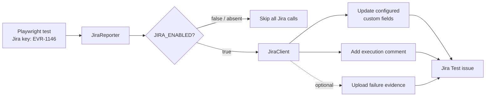

# Jira Test Case Integration

The framework can synchronize Playwright results with Jira Cloud custom **Test** issues such as `EVR-1146`. The integration is **disabled by default** and makes no Jira network calls unless `JIRA_ENABLED=true`.

## What the integration does

After a linked Playwright test finishes, `JiraReporter` can:

- update the custom **Execution Status** field;
- update the custom **Executed By** member field;
- update the custom **Environment** field;
- add a comment containing the test name, result, environment, browser project, duration, retry, and a shortened error message;
- optionally upload supported failure attachments smaller than the configured size limit.

It does not create, delete, or transition Jira issues. Fields that are not configured are left unchanged.



## Files involved

```text
config/jira.env.example                  # Safe configuration template
src/integrations/jira/JiraConfig.ts      # Toggle and environment parsing
src/integrations/jira/JiraModels.ts      # Jira request/result types
src/integrations/jira/JiraClient.ts      # Jira Cloud REST calls
src/reporting/jira/JiraReporter.ts       # Playwright-to-Jira result bridge
playwright.config.ts                     # Reporter registration
```

## Step 1 — Create a Jira automation identity

Use a dedicated Atlassian automation account with only the permissions needed to:

- browse the project;
- edit Test issues;
- add comments;
- add attachments, if attachment upload will be enabled.

Generate an API token for this account. Never use a password and never commit the API token.

## Step 2 — Find the custom field IDs and types

Jira displays names such as **Execution Status**, but its API requires IDs such as `customfield_10421`.

With an API token available in your local shell, query Jira fields:

```bash
curl --request GET \
  --url "https://aether.atlassian.net/rest/api/3/field" \
  --member "$JIRA_EMAIL:$JIRA_API_TOKEN" \
  --header "Accept: application/json"
```

Find the IDs for:

| Displayed Jira field | Configuration variable | Expected format |
|---|---|---|
| Execution Status | `JIRA_EXECUTION_STATUS_FIELD_ID` | Usually `select` |
| Executed By | `JIRA_EXECUTED_BY_FIELD_ID` | Jira member picker |
| Environment | `JIRA_ENVIRONMENT_FIELD_ID` | `select` or `text` |

If `jq` is installed, filter the large response directly:

```bash
curl --silent \
  --url "https://aether.atlassian.net/rest/api/3/field" \
  --member "$JIRA_EMAIL:$JIRA_API_TOKEN" \
  --header "Accept: application/json" \
| jq '.[] | select(.name == "Execution Status" or .name == "Executed By" or .name == "Environment") | {id, name, custom, schema}'
```

Example interpretation:

```json
{
    "id": "customfield_10421",
    "name": "Execution Status",
    "custom": true,
    "schema": { "type": "option" }
}
```

This becomes:

```env
JIRA_EXECUTION_STATUS_FIELD_ID=customfield_10421
JIRA_EXECUTION_STATUS_FIELD_FORMAT=select
```

If Jira returns this for Environment:

```json
{
    "id": "environment",
    "name": "Environment",
    "custom": false,
    "schema": { "type": "string", "system": "environment" }
}
```

use Jira's built-in field ID and Atlassian Document Format:

```env
JIRA_ENVIRONMENT_FIELD_ID=environment
JIRA_ENVIRONMENT_FIELD_FORMAT=adf
```

The Jira automation account's Atlassian account ID is configured as `JIRA_EXECUTED_BY_ACCOUNT_ID`.

Get the account ID belonging to the email/API token:

```bash
curl --silent \
  --url "https://aether.atlassian.net/rest/api/3/myself" \
  --member "$JIRA_EMAIL:$JIRA_API_TOKEN" \
  --header "Accept: application/json" \
| jq '{accountId, displayName, active}'
```

You may copy the returned `accountId` into `JIRA_EXECUTED_BY_ACCOUNT_ID`. If this variable is blank, the reporter automatically calls `/rest/api/3/myself` and uses the account belonging to `JIRA_EMAIL` and `JIRA_API_TOKEN`. The **Executed By** field itself still needs its separate `customfield_#####` ID from the field query.

Use Jira edit metadata for `EVR-1146` if you need to confirm which fields are editable and what values they accept:

```bash
curl --request GET \
  --url "https://aether.atlassian.net/rest/api/3/issue/EVR-1146/editmeta" \
  --member "$JIRA_EMAIL:$JIRA_API_TOKEN" \
  --header "Accept: application/json"
```

Playwright results are mapped to Jira values through configuration. For the current Aether fields, use:

- Passed → `Passed`
- Failed → `Failed`
- Skipped → `No Run`
- Timed Out → `Failed`
- Interrupted → `No Run`

Jira option spelling and capitalization must match exactly.

## Step 3 — Configure secrets and field mappings

Use `config/jira.env.example` as the reference, but provide real values through local environment variables or the CI secret store.

Example for a local terminal:

```bash
export JIRA_BASE_URL="https://aether.atlassian.net"
export JIRA_EMAIL="automation-account@example.com"
export JIRA_API_TOKEN="your-api-token"
export JIRA_EXECUTION_STATUS_FIELD_ID="customfield_12345"
export JIRA_EXECUTED_BY_FIELD_ID="customfield_12346"
export JIRA_EXECUTED_BY_ACCOUNT_ID="your-atlassian-account-id"
export JIRA_ENVIRONMENT_FIELD_ID="customfield_12347"
```

Do not put real Jira credentials into `config/jira.env.example`, README files, test data, screenshots, or commits.

### Select versus text fields

The reporter defaults Execution Status and Environment to Jira single-select fields:

```env
JIRA_EXECUTION_STATUS_FIELD_FORMAT=select
JIRA_ENVIRONMENT_FIELD_FORMAT=select
```

If either custom field is plain text, configure it explicitly:

```env
JIRA_ENVIRONMENT_FIELD_FORMAT=text
```

Supported formats are:

| Format | Use when field metadata indicates |
|---|---|
| `select` | `schema.type` is `option` |
| `multiselect` | `schema.type` is `array` and `items` is `option`, including multi-checkbox fields |
| `text` | A single-line custom text field accepts a string |
| `adf` | Jira's built-in `environment` field or another rich-text field expects Atlassian Document Format |

## Confirmed Aether field configuration

The metadata supplied for the Aether Jira site requires this configuration:

```env
JIRA_EXECUTION_STATUS_FIELD_ID=customfield_10284
JIRA_EXECUTION_STATUS_FIELD_FORMAT=multiselect
JIRA_STATUS_PASSED_VALUE=Passed
JIRA_STATUS_FAILED_VALUE=Failed
JIRA_STATUS_SKIPPED_VALUE=No Run
JIRA_STATUS_TIMED_OUT_VALUE=Failed
JIRA_STATUS_INTERRUPTED_VALUE=No Run

JIRA_EXECUTED_BY_FIELD_ID=customfield_10285
# Optional; blank automatically uses the email/token account through /myself.
JIRA_EXECUTED_BY_ACCOUNT_ID=
JIRA_EXECUTED_BY_IS_ARRAY=true

JIRA_ENVIRONMENT_FIELD_ID=environment
JIRA_ENVIRONMENT_FIELD_FORMAT=adf
```

Why these formats matter:

- Execution Status is a multi-checkbox field and expects an array such as `[{ "value": "Passed" }]`.
- Executed By is a People field represented by an array, even though its `isMulti` setting is false; it expects one array item such as `[{ "accountId": "..." }]`.
- Environment is Jira's built-in rich-text field and expects Atlassian Document Format rather than a plain string.

## Step 4 — Link a Playwright test to Jira

The recommended method is a structured test annotation:

```ts
test(
    'Create Event Definition',
    {
        annotation: {
            type: 'jira',
            description: 'EVR-1146',
        },
    },
    async ({ page }) => {
        // Test implementation
    },
);
```

The reporter accepts annotation types `jira` and `issue`.

A Jira key in the title is also supported:

```ts
test('Create Event Definition @EVR-1146', async ({ page }) => {
    // Test implementation
});
```

Tests without a Jira key are silently skipped. Existing `TC-LOC-001` Excel/Allure identifiers are not treated as Jira issue keys unless they match a real Jira project key and are deliberately placed in a Jira annotation or title.

## Step 5 — Verify while integration is off

The default state is OFF:

```bash
npx playwright test tests/ui/trigger-rules
```

This runs tests normally and makes no Jira calls because `JIRA_ENABLED` is absent.

You can also turn it off explicitly:

```bash
JIRA_ENABLED=false npx playwright test tests/ui/trigger-rules
```

## Step 6 — Perform a controlled first update

Use one temporary or approved Jira Test issue first. Link only one test, then run:

```bash
JIRA_ENABLED=true npx playwright test path/to/one-linked-test.spec.ts
```

Alternatively, after exporting all required variables:

```bash
npm run test:jira -- path/to/one-linked-test.spec.ts
```

Confirm in Jira that:

- Execution Status contains the test result;
- Executed By contains the automation account;
- Environment contains `qa`, `dev`, or `deskmeet`;
- exactly one useful execution comment was added;
- no unrelated fields or issue status were changed.

## Step 7 — Control optional behavior

### Comments

```env
JIRA_ADD_COMMENT=true
```

Set it to `false` if only custom fields should be updated.

### Failure attachments

For the configured Aether workflow, screenshot and per-test log upload is enabled for both passed and failed linked tests:

```env
JIRA_UPLOAD_TEST_ATTACHMENTS=true
```

Each linked execution uploads only:

- Playwright PNG/JPEG screenshots produced for that test;
- one sanitized `EVR-####-<timestamp>-test.log` containing status, environment, project, start/completion timestamps, duration, retry, captured stdout/stderr, and error details.

Trace and video files are deliberately excluded. Set this option to `false` to stop these uploads.

The older failure-only attachment switch remains available and is off by default:

```env
JIRA_UPLOAD_FAILURE_ATTACHMENTS=false
```

Enable it only after reviewing security and Jira storage impact:

```env
JIRA_UPLOAD_FAILURE_ATTACHMENTS=true
JIRA_MAX_ATTACHMENT_BYTES=10485760
```

It skips unsupported or oversized files. Attachments can contain application data, so review the evidence policy before enabling this option. The log sanitizer redacts common authorization headers, bearer credentials, tokens, API keys, and passwords, but uploaded evidence should still be treated as sensitive.

### Jira failure behavior

The recommended initial mode is non-blocking:

```env
JIRA_FAIL_ON_ERROR=false
```

Tests keep their real result if Jira is unavailable, and the reporter logs the synchronization error.

For a mature pipeline where Jira synchronization is mandatory:

```env
JIRA_FAIL_ON_ERROR=true
```

This causes reporter synchronization errors to fail the reporter operation. Enable it only after credentials, permissions, custom-field options, and Jira availability are stable.

## On/off reference

| Desired behavior | Configuration |
|---|---|
| Completely off; no Jira calls | `JIRA_ENABLED=false` or omit it |
| Update fields and comments | `JIRA_ENABLED=true`, `JIRA_ADD_COMMENT=true` |
| Update fields only | `JIRA_ENABLED=true`, `JIRA_ADD_COMMENT=false` |
| Attach screenshots and test logs for passed and failed tests | `JIRA_UPLOAD_TEST_ATTACHMENTS=true` |
| Attach evidence only for failures | `JIRA_UPLOAD_TEST_ATTACHMENTS=false`, `JIRA_UPLOAD_FAILURE_ATTACHMENTS=true` |
| Jira outage must not affect test results | `JIRA_FAIL_ON_ERROR=false` |
| Jira synchronization is mandatory | `JIRA_FAIL_ON_ERROR=true` |

## Troubleshooting

| Symptom | Likely cause |
|---|---|
| Reporter skips a test | No `jira`/`issue` annotation and no `@EVR-####` in its title |
| `400 Bad Request` | Wrong custom-field ID, field format, or select option spelling |
| `401 Unauthorized` | Email/API-token combination is incorrect |
| `403 Forbidden` | Automation account lacks project, edit, comment, or attachment permission |
| Field does not update | Field is absent from the issue context or not editable for the Test issue type |
| Member field fails | `JIRA_EXECUTED_BY_ACCOUNT_ID` is missing or is not a valid Atlassian account ID |
| Test passes but Jira logs an error | Expected when `JIRA_FAIL_ON_ERROR=false`; inspect logs and configuration |
| Too many Jira comments | Turn comments off or move toward a separate Test Execution issue per run |

## Recommended rollout

1. Keep Jira disabled in normal runs.
2. Configure one automation account and one approved test issue.
3. Discover and verify all custom-field IDs and formats.
4. Link one Playwright test using a `jira` annotation.
5. Enable field updates with comments and attachments off if desired.
6. Confirm the Jira result, then expand to a small module.
7. Store all credentials in CI secrets.
8. Enable failure attachments only after a security/storage review.
9. Decide whether historical execution requires a separate Jira Test Execution issue type instead of overwriting the current Test issue.
