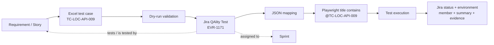
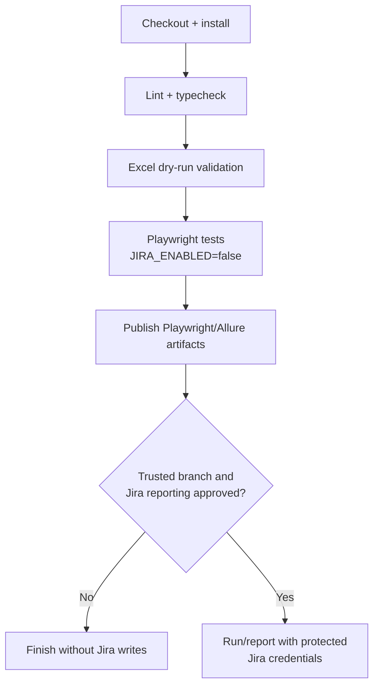

# Jira Integration Blueprint: Build It from Zero in Any Playwright Framework

This guide explains, in plain language and implementation order, how this framework was connected to Jira. It is intended both as a record of what was built here and as a reusable blueprint for another Playwright/TypeScript project.

The complete solution covers:

- manually drafting and reviewing test cases in Excel;
- validating Excel without touching Jira;
- creating or reusing Jira QAlity Test issues;
- writing returned Jira keys back to Excel;
- generating a machine-readable Test Case ID → Jira key map;
- linking Jira tests to Stories;
- assigning Jira tests to Sprints;
- connecting one Playwright spec to one or many test cases;
- updating execution status, environment, and Executed By;
- adding execution-summary comments and timestamps;
- attaching screenshots, videos, JSON, HTML, and sanitized logs;
- turning every Jira-writing operation on or off;
- keeping credentials outside Git;
- running UI and API tests correctly in CI.

> The source files are the canonical implementation. Code snippets in this guide explain the important patterns; copy the source files when exact parity is required.

## 1. Ultimate objective

The objective is traceability. A person should be able to start from a business test case and follow it through Excel, Jira, automation, execution evidence, and CI results.



The permanent identity is the **Test Case ID**, for example `TC-LOC-API-009`. Jira key `EVR-1171` is an external system identifier and may differ in another Jira site or project.

## 2. Two pipelines, not one

This distinction prevents many misunderstandings.

### Pipeline A: test-case management

```text
Excel → validate → Jira issue → Story link → Sprint → key saved to Excel/JSON
```

This pipeline is controlled by:

- `JIRA_IMPORT_ENABLED`
- `JIRA_LINK_STORIES_ENABLED`
- `JIRA_ASSIGN_SPRINTS_ENABLED`
- importer `--commit` and confirmation phrase

### Pipeline B: execution reporting

```text
Playwright result → Test Case ID → JSON map → Jira key → update Jira
```

This pipeline is controlled by `JIRA_ENABLED` plus the comment/evidence switches.

Creating Jira tests does not execute Playwright. Running Playwright does not create a missing Jira test. Keeping these responsibilities separate makes accidental Jira changes less likely.

## 3. Final folder structure

```text
quality-engineering/
├── config/
│   ├── environments/
│   │   ├── qa.env                 # Private local values; never commit
│   │   └── qa.env.example         # Safe template
│   └── jira.env.example           # Jira-only variable reference
├── resources/
│   ├── facility_test_cases.xlsx
│   ├── api_facility_test_cases.xlsx
│   └── jira-test-case-map.json    # TC ID → Jira key → spec file
├── scripts/jira/
│   ├── import-test-cases.mjs
│   ├── sync-test-case-mapping.mjs
│   ├── test-case-file-discovery.mjs
│   └── helpers/
│       ├── jira-reference.sh
│       └── README.md
├── src/integrations/jira/
│   ├── JiraConfig.ts
│   ├── JiraModels.ts
│   └── JiraClient.ts
├── src/reporting/jira/
│   └── JiraReporter.ts
├── tests/api/...                   # API specs use the API project
├── tests/ui/...                    # UI specs use Chromium + login state
└── playwright.config.ts
```

| Component | Plain-language purpose | What breaks without it? |
|---|---|---|
| Excel workbook | Human-readable source of test design | Manual cases, review, Stories and Jira keys have no managed source |
| Importer | Validates and optionally creates Jira tests | Bulk creation becomes manual and inconsistent |
| JSON map | Fast lookup from TC ID to Jira key | Tests would need Jira keys hard-coded or Excel parsed during every run |
| Jira config | Reads switches, fields and secrets | Behavior becomes hard-coded and unsafe |
| Jira models | Defines data passed between reporter and client | Metadata contracts become unclear and error-prone |
| Jira client | Owns Jira HTTP requests and payload formats | REST logic becomes duplicated across reporters/tests |
| Jira reporter | Converts Playwright results into Jira updates | Jira never receives execution results |
| Helper | Retrieves IDs and metadata safely | Engineers repeatedly invent curl commands and may expose tokens |

## 4. The order in which the integration was built

The implementation evolved in these stages:

1. Confirm Jira Cloud REST authentication and inspect the custom QAlity Test issue.
2. Discover project, issue type, custom fields, allowed values, account ID and link type.
3. Create ignored environment configuration and an explicit OFF switch.
4. Define a stable Test Case ID in Excel and Playwright.
5. Create a JSON lookup between Test Case ID, Jira key, workbook and test file.
6. Register a Playwright reporter that does nothing when disabled.
7. Add execution-status, environment and Executed By updates.
8. Add execution comments with result metadata and timestamps.
9. Add screenshots and logs, attachment size limits, secret redaction and ANSI cleanup.
10. Add Excel dry-run validation and guarded Jira bulk creation.
11. Write created/reused Jira keys back into Excel and regenerate JSON.
12. Add Story linking using the QAlity Test link type.
13. Add numeric Sprint IDs and sprint assignment.
14. Allow multiple unique test cases to share the same spec file.
15. Separate API tests from UI browser/session-storage authentication.
16. Consolidate curl and Bash discovery commands into a read-only helper.

The following sections explain each stage and its code.

## 5. Stage 1 — discover Jira metadata before coding

Never guess a custom field ID or payload shape. Jira field names are human labels; REST updates require IDs and types.

Use the consolidated helper:

```bash
./scripts/jira/helpers/jira-reference.sh auth
./scripts/jira/helpers/jira-reference.sh test-fields
./scripts/jira/helpers/jira-reference.sh editmeta EVR-1146
./scripts/jira/helpers/jira-reference.sh link-types
./scripts/jira/helpers/jira-reference.sh boards EVR
./scripts/jira/helpers/jira-reference.sh sprints 35
```

This project discovered:

| Jira concept | Value here | Meaning |
|---|---|---|
| Project | `EVR`, ID `10034` | Destination project |
| QAlity Test issue type | ID `10192` | Type created from Excel |
| Test Steps | `customfield_10281` | Long text |
| Expected Result | `customfield_10282` | Long text |
| Test Data | `customfield_10283` | Long text |
| Execution Status | `customfield_10284` | Multi-checkbox array |
| Executed By | `customfield_10285` | People field, represented as an array here |
| Environment | `environment` | Built-in ADF/string field depending on Jira metadata |
| Sprint | `customfield_10020` | Jira Software sprint field |
| QAlity Test link type | ID `10071` | Outward `tests`, inward `is tested by` |
| Scrum board | ID `35` | Board used to query sprints |
| Chosen Sprint | `598` | Numeric sprint ID stored in current Excel/map rows |

These values are Jira-site-specific. In another project, run the helper and replace them.

## 6. Stage 2 — protect credentials and make Jira OFF by default

Real credentials live in `config/environments/qa.env`. Only `qa.env.example` is committed.

The important `.gitignore` rule is:

```gitignore
/config/environments/*.env
!/config/environments/*.env.example
```

Minimum private configuration:

```dotenv
JIRA_BASE_URL=https://your-company.atlassian.net
JIRA_EMAIL=automation-account@example.com
JIRA_API_TOKEN=secret-value
JIRA_ENABLED=false
JIRA_IMPORT_ENABLED=false
```

Never put a token in:

- a spec file;
- a committed JSON file;
- an example environment file;
- a curl command saved in shell history;
- a Jira comment or attachment;
- a CI log.

### Why multiple switches were added

One switch was not sufficient because creation and reporting have different risk levels.

| Variable | Default | Authority granted |
|---|---:|---|
| `JIRA_ENABLED` | false | Execution results may update existing Jira issues |
| `JIRA_IMPORT_ENABLED` | false | Importer may create/reuse Jira test issues |
| `JIRA_LINK_STORIES_ENABLED` | false | Importer may create issue links |
| `JIRA_ASSIGN_SPRINTS_ENABLED` | false | Importer may move tests into sprints |
| `JIRA_ADD_COMMENT` | true | Reporter adds execution summary when Jira is enabled |
| `JIRA_UPLOAD_TEST_ATTACHMENTS` | configurable | Upload evidence for all selected executions |
| `JIRA_UPLOAD_FAILURE_ATTACHMENTS` | false | Upload evidence only when execution is not passed |
| `JIRA_FAIL_ON_ERROR` | false | Whether Jira failure should fail the Playwright run |

## 7. Stage 3 — implement the configuration reader

Canonical source: [`src/integrations/jira/JiraConfig.ts`](../../src/integrations/jira/JiraConfig.ts).

The config object centralizes every option:

```ts
export interface JiraConfig {
    enabled: boolean;
    baseUrl: string;
    email: string;
    apiToken: string;
    executionStatusFieldId?: string;
    executionStatusFieldFormat: 'text' | 'select' | 'multiselect' | 'adf';
    executedByFieldId?: string;
    executedByAccountId?: string;
    executedByIsArray: boolean;
    environmentFieldId?: string;
    environmentFieldFormat: 'text' | 'select' | 'multiselect' | 'adf';
    addComment: boolean;
    uploadTestAttachments: boolean;
    uploadFailureAttachments: boolean;
    failOnError: boolean;
    maxAttachmentBytes: number;
}
```

The reader treats values such as `true`, `1`, `yes`, and `on` as enabled. It removes trailing slashes from the Jira base URL and validates credentials only when Jira reporting is ON:

```ts
if (config.enabled) {
    const missing = [
        ['JIRA_BASE_URL', config.baseUrl],
        ['JIRA_EMAIL', config.email],
        ['JIRA_API_TOKEN', config.apiToken],
    ].filter(([, value]) => !value);

    if (missing.length > 0) {
        throw new Error('Jira integration is enabled but credentials are incomplete');
    }
}
```

Why validate conditionally? A developer must be able to run normal tests with Jira OFF and without Jira credentials.

## 8. Stage 4 — establish the Excel contract

Each workbook row represents one business test case. The essential columns are:

| Column | Example | Owner |
|---|---|---|
| Test Case ID | `TC-LOC-API-009` | Engineer; permanent and unique |
| Test Case Title | `Delete non-existent facility` | Engineer/reviewer |
| Test Steps | Human-readable steps | Engineer/reviewer |
| Test Data | Invalid facility ID | Engineer/reviewer |
| Expected Result | API returns expected validation response | Engineer/reviewer |
| Priority | Medium | Engineer/reviewer |
| Linkable Story | `EVR-1135` | Engineer |
| Sprint ID | `598` | Engineer after Jira lookup |
| Jira Key | `EVR-1171` | Importer or manual entry |
| Automation Test File | `tests/api/facilities/facilityNegative.spec.ts` | Discovery/sync script |

Important rules:

- Test Case ID must never be reused for a different test.
- Jira Key is empty until Jira returns a real key.
- Sprint requires the numeric ID, not the display name `Sprint 14`.
- Many unique Test Case IDs may point to the same spec file.
- The same Test Case ID must not appear in two spec files.

Example of valid many-to-one mapping:

```text
TC-LOC-API-005 ─┐
TC-LOC-API-006 ─┤
TC-LOC-API-007 ─┼── tests/api/facilities/facilityNegative.spec.ts
TC-LOC-API-008 ─┤
TC-LOC-API-009 ─┘
```

## 9. Stage 5 — find automation files by Test Case ID

Canonical source: [`scripts/jira/test-case-file-discovery.mjs`](../../scripts/jira/test-case-file-discovery.mjs).

The scanner recursively reads `tests/**/*.spec.ts` and searches for IDs matching:

```js
const TEST_CASE_ID_PATTERN = /\bTC-[A-Z0-9-]+-\d+\b/gi;
```

This eliminates manual file mapping in most cases. If `TC-LOC-API-009` appears in a title, the scanner can write that spec path to Excel/JSON.

## 10. Stage 6 — build the JSON mapping

Canonical source: [`resources/jira-test-case-map.json`](../../resources/jira-test-case-map.json).

One entry looks like:

```json
{
  "TC-LOC-API-009": {
    "jiraKey": "EVR-1171",
    "testFile": "tests/api/facilities/facilityNegative.spec.ts",
    "sprintId": "598",
    "workbook": "resources/api_facility_test_cases.xlsx",
    "sheet": "API Facilities"
  }
}
```

The sync script, [`scripts/jira/sync-test-case-mapping.mjs`](../../scripts/jira/sync-test-case-mapping.mjs), ensures Excel contains `Jira Key`, `Automation Test File`, and `Sprint ID` columns and regenerates this map.

Run it with:

```bash
npm run jira:sync-map
```

The reporter imports JSON because it is fast, reviewable in Git, and does not require parsing Excel at test completion.

## 11. Stage 7 — implement dry-run before Jira creation

Canonical source: [`scripts/jira/import-test-cases.mjs`](../../scripts/jira/import-test-cases.mjs).

Dry run is the default and does not call Jira:

```bash
TEST_ENV=qa npm run jira:import -- \
  --file resources/api_facility_test_cases.xlsx \
  --dry-run
```

All workbooks:

```bash
TEST_ENV=qa npm run jira:import -- --all --dry-run
```

It performs these steps:

1. Resolve selected workbook paths.
2. Read headings instead of depending on fixed column numbers.
3. Convert rows into normalized objects.
4. Validate required text, unique Test Case ID, Jira key syntax, Story keys and Sprint ID.
5. Convert descriptions into Atlassian Document Format (ADF).
6. Build the exact Jira create payload locally.
7. discover the automation spec file.
8. Write `test-results/jira-import-dry-run.json`.

Read the report correctly:

```bash
jq '.summary' test-results/jira-import-dry-run.json
jq '.testCases[] | select(.validation.valid == false)' \
  test-results/jira-import-dry-run.json
```

Typing the JSON path by itself asks Bash to execute the file and produces `Permission denied`.

## 12. Stage 8 — guard commit mode

Commit requires three independent signals:

1. `JIRA_IMPORT_ENABLED=true`
2. `--commit`
3. exact confirmation phrase `CREATE_EVR_JIRA_TESTS`

```bash
TEST_ENV=qa npm run jira:import -- --all --commit \
  --confirm CREATE_EVR_JIRA_TESTS
```

Before commit, the importer:

- stops if validation failed;
- searches Jira by the unique automation label;
- reuses exactly one matching issue;
- creates a new issue when there is no match;
- stops on multiple matches instead of guessing;
- validates Stories and Sprint IDs when those features are enabled.

The unique label makes retries idempotent. Re-running after a partial failure should find the already-created test instead of blindly duplicating it.

After Jira returns keys, `persistMappings()`:

- writes the Jira key into the correct Excel row by Test Case ID;
- writes the discovered automation file;
- preserves Sprint ID;
- regenerates `jira-test-case-map.json`;
- writes the audit report `test-results/jira-import-commit-result.json`.

## 13. Stage 9 — link tests to Stories

With:

```dotenv
JIRA_LINK_STORIES_ENABLED=true
JIRA_STORY_LINK_TYPE_ID=10071
```

the importer validates the Story keys and calls Jira's issue-link endpoint. Direction is important:

```json
{
  "type": { "id": "10071" },
  "outwardIssue": { "key": "EVR-1171" },
  "inwardIssue": { "key": "EVR-1135" }
}
```

For this Jira link type, the QAlity Test **tests** the Story and the Story **is tested by** the QAlity Test. The importer reads existing links first and avoids adding the same link twice.

## 14. Stage 10 — assign tests to Sprints

Excel stores a numeric Sprint ID such as `598`. It does not store only the name because sprint names can be repeated.

Find IDs with:

```bash
./scripts/jira/helpers/jira-reference.sh sprints 35
```

Enable assignment only during an approved import:

```dotenv
JIRA_ASSIGN_SPRINTS_ENABLED=true
```

The importer validates each sprint through `/rest/agile/1.0/sprint/{id}` and assigns resolved Jira tests through `/rest/agile/1.0/sprint/{id}/issue`.

In another project, do not copy `598`; query its board and use the correct numeric ID.

## 15. Stage 11 — add the Test Case ID to Playwright

A normal spec title contains the Test Case ID, not the Jira key:

```ts
test('Delete Non-existent Facility ID @TC-LOC-API-009', async ({
    facilityApiClient,
}) => {
    const response = await facilityApiClient.sendRequest(
        'DELETE',
        '/api/facility/non-existent-id',
    );

    expect(response.status()).toBe(400);
});
```

Why avoid hard-coded Jira keys?

- the same code can be used against a different Jira project;
- Jira issues may be migrated or recreated;
- Test Case ID remains meaningful to QA;
- mapping changes require JSON/Excel updates, not test-code edits.

The reporter supports three lookup methods, in this order:

1. Playwright annotation such as `{ type: 'jira', description: 'EVR-1171' }`;
2. a Jira key explicitly present in the title;
3. normal approach: Test Case ID in title → JSON mapping → Jira key.

## 16. Stage 12 — define execution models

Canonical source: [`src/integrations/jira/JiraModels.ts`](../../src/integrations/jira/JiraModels.ts).

`JiraExecutionSummary` is the contract between Playwright and Jira:

```ts
export interface JiraExecutionSummary {
    issueKey: string;
    testCaseId?: string;
    testTitle: string;
    specFile: string;
    sourceLine: number;
    sourceColumn: number;
    status: 'Passed' | 'Failed' | 'Skipped' | 'Timed Out' | 'Interrupted';
    rawStatus: string;
    expectedStatus: string;
    outcome: string;
    environment: string;
    projectName: string;
    startedAt: string;
    completedAt: string;
    durationMs: number;
    retry: number;
    workerIndex: number;
    parallelIndex: number;
    repeatEachIndex: number;
    timeoutMs: number;
    tags: string[];
    attachmentCount: number;
    errorCount: number;
    errorMessage?: string;
}
```

Keeping this model independent of Playwright makes `JiraClient` easier to reuse and unit test.

## 17. Stage 13 — implement the Jira HTTP client

Canonical source: [`src/integrations/jira/JiraClient.ts`](../../src/integrations/jira/JiraClient.ts).

The central request method builds Basic authentication from email and API token:

```ts
private async request(resource: string, init: RequestInit): Promise<Response> {
    const authorization = Buffer.from(
        `${this.config.email}:${this.config.apiToken}`,
    ).toString('base64');

    const response = await fetch(`${this.config.baseUrl}${resource}`, {
        ...init,
        headers: {
            Accept: 'application/json',
            Authorization: `Basic ${authorization}`,
            ...init.headers,
        },
    });

    if (!response.ok) {
        throw new Error(`Jira request failed: ${response.status}`);
    }
    return response;
}
```

Only this client should know authentication and Jira endpoints. Reporters should request actions such as `updateExecution()` or `uploadAttachment()`.

### Custom-field value shapes

Jira field types require different JSON:

```ts
if (format === 'select') return { value };       // single option
if (format === 'multiselect') return [{ value }]; // checkbox/multiple option
if (format === 'adf') return toDocument([value]); // rich text
return value;                                    // plain text
```

This is why Execution Status uses `multiselect` here: Jira reported it as an array of options. Environment uses `adf` because Jira returned the built-in `environment` field.

### Updating the issue

The client builds one `fields` object and sends one PUT:

```json
{
  "fields": {
    "customfield_10284": [{ "value": "Failed" }],
    "customfield_10285": [{ "accountId": "712020:..." }],
    "environment": {
      "type": "doc",
      "version": 1,
      "content": []
    }
  }
}
```

Do not copy this payload blindly; use `editmeta` to confirm shapes in the destination project.

## 18. Stage 14 — resolve Executed By

If `JIRA_EXECUTED_BY_ACCOUNT_ID` is blank, the client calls:

```text
GET /rest/api/3/myself
```

It caches the returned `accountId`, display name and available email. If an account ID is configured, it calls `/rest/api/3/member?accountId=...`.

The field receives only the account ID:

```ts
const memberValue = { accountId: executedBy.accountId };
fields[executedByFieldId] = executedByIsArray
    ? [memberValue]
    : memberValue;
```

The boolean exists because Jira member-picker plugins can represent a single member either as an object or as a one-element array. Here, QAlity's People field requires `true`.

## 19. Stage 15 — implement the Playwright reporter

Canonical source: [`src/reporting/jira/JiraReporter.ts`](../../src/reporting/jira/JiraReporter.ts).

Register it in [`playwright.config.ts`](../../playwright.config.ts):

```ts
reporter: [
    ['list'],
    ['./src/reporting/jira/JiraReporter.ts'],
],
```

The constructor loads configuration but creates a Jira client only when enabled:

```ts
constructor() {
    this.config = loadJiraConfig();
    if (this.config.enabled) {
        this.client = new JiraClient(this.config);
    }
}
```

`onTestEnd()` is called once per completed Playwright result:

```ts
onTestEnd(test: TestCase, result: TestResult): void {
    if (!this.config.enabled || !this.client) return;

    const issueKey = this.findIssueKey(test);
    if (!issueKey) return;

    this.pendingUpdates.push(this.processTestResult(issueKey, test, result));
}
```

The reporter queues asynchronous work because Playwright's `onTestEnd` callback is not awaited in the same way as an ordinary async function. `onEnd()` waits for every Jira update:

```ts
async onEnd(): Promise<void> {
    await Promise.all(this.pendingUpdates);
}
```

Without this queue, the Node process could finish before Jira requests complete.

### Status translation

```ts
const statusMap = {
    passed: 'Passed',
    failed: 'Failed',
    skipped: 'Skipped',
    timedOut: 'Timed Out',
    interrupted: 'Interrupted',
};
```

Environment configuration then maps framework status to Jira option values, for example `Skipped → No Run` and `Timed Out → Failed`.

## 20. Stage 16 — add execution comments

The reporter sends enough metadata to understand an execution without opening the local report:

- Test Case ID and Jira issue;
- full Playwright title;
- spec file, line and column;
- environment and project;
- expected and actual status;
- outcome;
- start, completion, report timestamp and duration;
- retry, worker, parallel and repeat indexes;
- timeout and tags;
- attachment and error counts;
- sanitized error message;
- Jira member who executed/reported the run.

The Jira Cloud comment endpoint expects Atlassian Document Format:

```ts
await request(`/rest/api/3/issue/${issueKey}/comment`, {
    method: 'POST',
    headers: { 'Content-Type': 'application/json' },
    body: JSON.stringify({ body: adfDocument }),
});
```

For a compact visual presentation, build an ADF table with a `Field` and `Value` column and place the failure in a separate code block. If the destination Jira renderer or app does not support tables, fall back to ADF paragraphs. Keep the formatting method isolated so this presentation can change without touching result collection.

## 21. Stage 17 — attach screenshots, videos and logs

The reporter accepts these Playwright attachment MIME types:

```ts
const supportedContentTypes = new Set([
    'image/png',
    'image/jpeg',
    'text/plain',
    'text/html',
    'application/json',
    'video/webm',
]);
```

Jira upload requires multipart form data and the anti-CSRF header:

```ts
const form = new FormData();
form.append('file', new Blob([contents]), path.basename(filePath));

await request(`/rest/api/3/issue/${issueKey}/attachments`, {
    method: 'POST',
    headers: { 'X-Atlassian-Token': 'no-check' },
    body: form,
});
```

`JIRA_MAX_ATTACHMENT_BYTES` prevents an oversized artifact from being sent. The framework creates one timestamped log attachment such as:

```text
EVR-1171-2026-08-11T15-17-13-678Z-test.log
```

### Passed versus failed evidence policy

| Settings | Result |
|---|---|
| Both upload switches false | No evidence uploaded |
| `JIRA_UPLOAD_TEST_ATTACHMENTS=true` | Supported evidence uploaded for passed and failed tests |
| Only `JIRA_UPLOAD_FAILURE_ATTACHMENTS=true` | Evidence uploaded only for non-passed tests |

### Prerequisite/postcondition evidence

Do not attach every action screenshot. For a destructive prerequisite such as deactivating a facility, attach focused evidence that proves the prerequisite succeeded: response/status JSON for API work, or one named confirmation screenshot for UI work. This keeps Jira evidence meaningful.

## 22. Stage 18 — sanitize logs

Playwright assertion errors can contain terminal ANSI color sequences such as `\x1B[31m`. Logs may also contain tokens or authorization headers.

The reporter sanitizes before uploading:

```ts
return content
    .replace(new RegExp(String.raw`\x1B\[[0-?]*[ -/]*[@-~]`, 'g'), '')
    .replace(/\\x1B\[[0-?]*[ -/]*[@-~]/gi, '')
    .replace(/(authorization\s*[:=]\s*)([^\s,;]+)/gi, '$1[REDACTED]')
    .replace(/(bearer\s+)[A-Za-z0-9._~+/-]+=*/gi, '$1[REDACTED]');
```

The two ANSI expressions handle both real escape characters and text that literally contains `\x1B`.

In another framework, extend redaction for its own secrets, cookies, session IDs and private headers.

## 23. Stage 19 — error policy

Jira is usually reporting infrastructure, not the product under test. Initially use:

```dotenv
JIRA_FAIL_ON_ERROR=false
```

Then a Jira outage is logged but does not replace the genuine Playwright result. Use `true` only if Jira synchronization is a mandatory release requirement.

Examples:

- Product assertion fails and Jira succeeds → test remains failed; Jira is updated.
- Product test passes and Jira returns 500 with fail-on-error false → test remains passed; reporter logs the Jira error.
- Same condition with fail-on-error true → overall reporting/run can fail.

## 24. Stage 20 — separate API tests from UI login state

API tests authenticate using API clients/headers and should not depend on browser cookies or `sessionStorage`.

The Playwright project separation is:

```ts
projects: [
    {
        name: 'API',
        testDir: './tests/api',
        use: { storageState: undefined },
    },
    {
        name: 'setup',
        testMatch: /.*auth\.setup\.ts/,
        use: { storageState: undefined },
    },
    {
        name: 'Chromium',
        testIgnore: '**/api/**/*.spec.ts',
        use: { storageState: 'playwright/.auth/member.json' },
        dependencies: ['setup'],
    },
];
```

The custom context fixture also bypasses session restoration for the API project:

```ts
if (testInfo.project.name === 'API') {
    await use(context);
    return;
}
```

Run API tests with:

```bash
npx playwright test --project=API
```

Run UI tests with:

```bash
npx playwright test --project=Chromium
```

This change is separate from Jira but important for a clean integration pipeline: API execution must not fail merely because a UI session file is missing or expired.

## 25. End-to-end daily workflow

### New test case

1. Add a unique Test Case ID and details to Excel.
2. Add optional Story and numeric Sprint ID.
3. Review the row manually.
4. Add the same Test Case ID to the Playwright title.
5. Run dry mode for the workbook.
6. Fix every validation error.
7. Run all-workbook dry mode to catch cross-file duplicates.
8. Obtain approval.
9. Temporarily enable importer/link/sprint switches as needed.
10. Commit the import with the confirmation phrase.
11. Verify Jira issue, Story link and Sprint.
12. Verify Jira key and automation file were written to Excel/JSON.
13. Turn import/link/sprint switches OFF again.

### Execute without Jira

```bash
TEST_ENV=qa JIRA_ENABLED=false \
  npx playwright test tests/api/facilities/facilityNegative.spec.ts \
  --project=API --grep 'TC-LOC-API-009'
```

### Execute and report to Jira

```bash
TEST_ENV=qa JIRA_ENABLED=true \
  npx playwright test tests/api/facilities/facilityNegative.spec.ts \
  --project=API --grep 'TC-LOC-API-009'
```

The reporter reads `TC-LOC-API-009`, resolves `EVR-1171`, and updates only that Jira issue.

## 26. CI/CD pipeline design

A safe pipeline separates validation, tests and Jira writes:



Recommended rules:

- Store Jira email/token in the CI secret manager.
- Do not enable Jira on untrusted pull requests or forked code.
- Start with `JIRA_FAIL_ON_ERROR=false`.
- Never enable import commit automatically on every test run.
- Make Jira issue creation a manual/approved job.
- Retain dry-run and commit JSON reports as audit artifacts.
- Limit the automation Jira account to required projects and actions.

Example execution job environment:

```yaml
env:
  TEST_ENV: qa
  JIRA_ENABLED: "true"
  JIRA_BASE_URL: ${{ secrets.JIRA_BASE_URL }}
  JIRA_EMAIL: ${{ secrets.JIRA_EMAIL }}
  JIRA_API_TOKEN: ${{ secrets.JIRA_API_TOKEN }}
```

Adapt secret syntax to GitHub Actions, Bitbucket Pipelines, Jenkins, GitLab, Azure DevOps, or the selected CI system.

## 27. How to port this integration to another project

### Copy these implementation components

1. `src/integrations/jira/`
2. `src/reporting/jira/JiraReporter.ts`
3. `scripts/jira/`
4. safe environment variable examples
5. reporter registration in `playwright.config.ts`
6. Excel schema and a blank JSON mapping

### Replace project-specific values

| Current value | Replace with |
|---|---|
| `aether.atlassian.net` | Destination Jira site |
| Project ID `10034` / key `EVR` | Destination Jira project |
| Issue type ID `10192` | Destination test issue type |
| `customfield_10281`–`10285` | Destination custom field IDs |
| Sprint field `customfield_10020` | Destination sprint field |
| Link type `10071` | Destination test relationship |
| Board `35` | Destination Scrum board |
| Sprint `598` | Chosen destination sprint ID |
| `TC-LOC...` convention | New team's stable test ID convention |

### Adjust the importer

The current importer has project and field IDs near its top. For a highly reusable package, move these into environment variables and validate them at startup:

```dotenv
JIRA_PROJECT_ID=...
JIRA_TEST_ISSUE_TYPE_ID=...
JIRA_TEST_STEPS_FIELD_ID=...
JIRA_EXPECTED_RESULT_FIELD_ID=...
JIRA_TEST_DATA_FIELD_ID=...
JIRA_SPRINT_FIELD_ID=...
```

### Verify permissions

The automation account may need:

- Browse Projects
- Create Issues
- Edit Issues
- Add Comments
- Create Attachments
- Link Issues
- Manage/assign issues to Sprint as allowed by Jira Software

Use least privilege and confirm requirements with the Jira administrator.

## 28. Verification checklist for another project

Do these in order:

- [ ] `auth` helper returns the expected automation member.
- [ ] Field helper returns the intended custom field IDs and shapes.
- [ ] `editmeta` shows fields are editable for the test issue.
- [ ] Link type direction is confirmed.
- [ ] Board and numeric Sprint ID are confirmed.
- [ ] Real env file is ignored by Git.
- [ ] Jira is OFF by default.
- [ ] One Excel row passes dry-run.
- [ ] All workbooks pass dry-run without duplicate Test Case IDs.
- [ ] One approved Jira test is created/reused.
- [ ] Jira key is written back to Excel and JSON.
- [ ] Story link direction is correct.
- [ ] Sprint assignment is correct.
- [ ] One passing execution updates Jira correctly.
- [ ] One failing execution includes clean error details and evidence.
- [ ] ANSI color codes do not appear in uploaded logs/comments.
- [ ] Tokens and authorization headers are redacted.
- [ ] Jira outage behavior matches `JIRA_FAIL_ON_ERROR` policy.
- [ ] API project runs without UI session-storage files.
- [ ] CI obtains credentials only from protected secrets.

## 29. Common failure diagnosis

| Symptom | Likely cause | Fix |
|---|---|---|
| HTTP 401 | Wrong/expired token or email mismatch | Generate token, verify with helper `auth` |
| HTTP 403 | Missing permission | Ask Jira admin for the required project permission |
| Field cannot be set | Wrong ID, context or JSON shape | Run `editmeta`; use select/multiselect/ADF correctly |
| Executed By fails | Wrong account ID or object/array shape | Use `/myself`; toggle `JIRA_EXECUTED_BY_IS_ARRAY` |
| Environment fails | Built-in field expects ADF | Set format based on Jira schema |
| Test runs but Jira is unchanged | Jira disabled, no TC ID, or map has no key | Check switch, title and JSON mapping |
| Wrong Jira test updated | Duplicate Test Case ID or stale map | Fix duplicate and rerun mapping sync |
| Duplicate Jira tests | No idempotent label search | Search before create and stop on multiple matches |
| Story link reversed | Inward/outward issue order is wrong | Confirm link type directions before creating link |
| Sprint name known but no ID | UI/export shows name only | Query board sprints and store numeric ID |
| Attachment missing | MIME type unsupported, no path, or too large | Check reporter filters and byte limit |
| Color codes in logs | ANSI not sanitized | Strip actual and textual escape sequences |
| JSON path says permission denied | JSON was executed as a program | Open with `jq`, `less`, `cat`, or editor |
| API test requests UI session | API project/fixture not separated | Use `--project=API` and context bypass |

## 30. Design principles learned

1. **Stable internal ID first:** test code references Test Case ID, not Jira key.
2. **Dry-run before mutation:** preview and validate every payload locally.
3. **Explicit safety gates:** separate creation, linking, sprint assignment and reporting.
4. **One HTTP client:** authentication and Jira payload logic stay centralized.
5. **One reporter adapter:** Playwright-specific result collection stays out of JiraClient.
6. **Schema discovery:** Jira metadata decides field JSON shape.
7. **Idempotent creation:** search unique labels before creating issues.
8. **Write identifiers back:** Jira-returned keys update Excel and JSON automatically.
9. **Evidence with purpose:** upload useful confirmation, not every possible artifact.
10. **Sanitize before publishing:** remove secrets and terminal formatting.
11. **Reporting should be resilient:** Jira failure normally should not hide product-test truth.
12. **API/UI isolation:** API tests do not depend on browser authentication state.

## 31. Canonical files and further reading

- [Jira configuration](../../src/integrations/jira/JiraConfig.ts)
- [Jira execution models](../../src/integrations/jira/JiraModels.ts)
- [Jira REST client](../../src/integrations/jira/JiraClient.ts)
- [Playwright Jira reporter](../../src/reporting/jira/JiraReporter.ts)
- [Excel/Jira importer](../../scripts/jira/import-test-cases.mjs)
- [Mapping synchronizer](../../scripts/jira/sync-test-case-mapping.mjs)
- [Spec-file discovery](../../scripts/jira/test-case-file-discovery.mjs)
- [Read-only Jira helper](../../scripts/jira/helpers/README.md)
- [Operational quick start](QUICK-START.md)
- [Detailed operational guide](README.md)
- [Bulk-import guide](../jira-bulk-test-case-import.md)
- [Execution integration guide](../jira-test-case-integration.md)

Use this blueprint to understand and reproduce the architecture. Use `QUICK-START.md` for normal daily operation.
