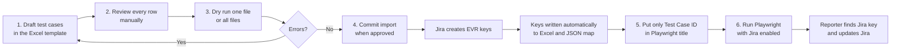
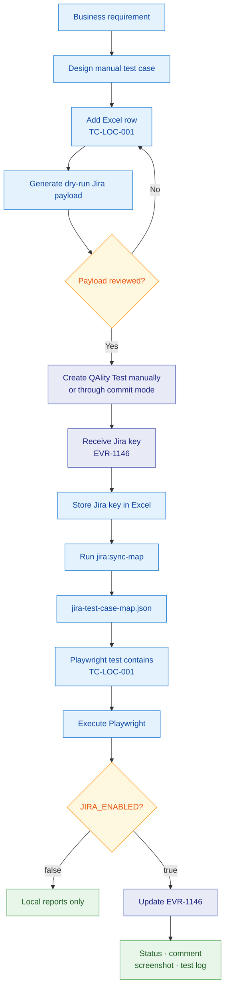
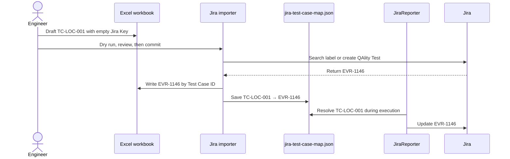

# Jira Test Management and Playwright Integration

> New engineer? Begin with the shorter [Jira Test Integration Quick Start](QUICK-START.md). This document remains the detailed reference.

> Need Jira curl commands or field/board/sprint lookups? Use the consolidated [Jira helper reference](../../scripts/jira/helpers/README.md).

> Implementing the same integration in another automation project? Follow the code-by-code [Jira Integration Blueprint](IMPLEMENTATION-BLUEPRINT.md).

This guide explains the complete SentinelX test-management workflow in plain language. It covers manual test-case design, Excel maintenance, Jira QAlity Test creation, Jira-key mapping, Playwright execution, execution-status updates, screenshots, test logs, dry-run bulk-import previews, and security.

The intended reader can be new to Jira, Excel-based test management, or Playwright.

> **Current safety boundary:** automated Jira result updates use `JIRA_ENABLED`. Excel-to-Jira creation is disabled by default and separately requires `JIRA_IMPORT_ENABLED=true`, `--commit`, and the exact confirmation phrase. Dry run remains the default.

## Start here: the complete beginner workflow

Use this order for every new module or test case:



In plain language:

1. Write the test case in an Excel workbook under `resources/`.
2. A person reviews the wording, steps, data, expected result, priority, and unique Test Case ID.
3. Run dry mode. It checks and previews data but does not contact Jira.
4. Correct every error and review every warning.
5. Run commit mode only after approval. Jira keys are then written automatically to Excel and the JSON map.
   If `Linkable Story` is populated and Story linking is enabled, the Jira test is also linked to that Story using the QAlity Test relationship.
6. Put the **Test Case ID**, not the Jira key, in the Playwright test title.
7. Run the test with `JIRA_ENABLED=true`. The reporter looks up the Jira key and posts the result.

The two switches do different jobs:

| Switch | Purpose |
|---|---|
| `JIRA_IMPORT_ENABLED` | Allows Excel test cases to be created in Jira |
| `JIRA_LINK_STORIES_ENABLED` | Allows imported/found Jira tests to be linked to Excel `Linkable Story` keys |
| `JIRA_ASSIGN_SPRINTS_ENABLED` | Allows imported/found Jira tests to be assigned to numeric Excel `Sprint ID` values |
| `JIRA_ENABLED` | Allows Playwright execution results to update existing Jira tests |

They are independent. Importing test cases does not execute Playwright, and executing Playwright does not create missing Jira test cases.

## Table of contents

1. [What the integration accomplishes](#1-what-the-integration-accomplishes)
2. [Simple mental model](#2-simple-mental-model)
3. [Files and folders involved](#3-files-and-folders-involved)
4. [One-time Jira and environment setup](#4-one-time-jira-and-environment-setup)
5. [Design a test case manually](#5-design-a-test-case-manually)
6. [Add the test case to Excel](#6-add-the-test-case-to-excel)
7. [Preview Excel-to-Jira payloads](#7-preview-excel-to-jira-payloads)
8. [Create a QAlity Test manually in Jira](#8-create-a-qality-test-manually-in-jira)
9. [Get and store the Jira key](#9-get-and-store-the-jira-key)
10. [Synchronize Excel and JSON mappings](#10-synchronize-excel-and-json-mappings)
11. [Map the test case to Playwright](#11-map-the-test-case-to-playwright)
12. [Execute with Jira OFF or ON](#12-execute-with-jira-off-or-on)
13. [Verify Jira after execution](#13-verify-jira-after-execution)
14. [Passed and failed execution behavior](#14-passed-and-failed-execution-behavior)
15. [Bulk upload](#15-bulk-upload)
16. [Troubleshooting](#16-troubleshooting)
17. [Security rules](#17-security-rules)
18. [New-engineer checklist](#18-new-engineer-checklist)

---

## 1. What the integration accomplishes

The framework connects four records that describe the same test:

```text
Business test case
    ↕
Excel row: TC-LOC-001
    ↕
Jira QAlity Test: EVR-1146
    ↕
Playwright test: createFacility.spec.ts
```

After Playwright completes a linked test, the framework can update Jira with:

- Passed, Failed, or No Run execution status;
- the Jira account that executed the automation;
- the environment, such as `qa`;
- an execution comment with test name, browser project, duration, retry, and error details;
- Playwright screenshots;
- one timestamped, sanitized test log.

It also continues updating the existing Excel execution status and date through `ExcelReporter`.

---

## 2. Simple mental model

Think of a library:

- The **Test Case ID** is the permanent catalog number, such as `TC-LOC-001`.
- Excel is the librarian's detailed register.
- Jira is the online tracking card, such as `EVR-1146`.
- The Playwright test is the machine that performs the check.
- `jira-test-case-map.json` is the lookup index connecting the catalog number to the Jira card.
- `JiraReporter` is the messenger that delivers the result and evidence.

The Test Case ID is the primary identifier because Jira keys and source files can change while the business test remains the same.

### Complete lifecycle



---

## 3. Files and folders involved

```text
quality-engineering/
├── config/
│   ├── environments/
│   │   ├── qa.env                       # Local secrets; ignored by Git
│   │   ├── qa.env.example               # Safe committed template
│   │   ├── dev.env
│   │   ├── dev.env.example
│   │   ├── deskmeet.env
│   │   └── deskmeet.env.example
│   └── jira.env.example                  # Jira configuration reference
├── resources/
│   ├── facility_test_cases.xlsx          # UI/manual test cases
│   ├── api_facility_test_cases.xlsx      # API test cases
│   └── jira-test-case-map.json           # TC ID → Jira key → test file
├── scripts/jira/
│   ├── import-test-cases.mjs             # Dry-run validator and gated Jira importer
│   └── sync-test-case-mapping.mjs        # Excel ↔ JSON mapping synchronizer
├── src/integrations/jira/
│   ├── JiraConfig.ts                     # ON/OFF switch and settings
│   ├── JiraClient.ts                     # Jira REST updates and attachments
│   └── JiraModels.ts                     # TypeScript contracts
├── src/reporting/jira/
│   └── JiraReporter.ts                   # Maps Playwright results to Jira
├── tests/
│   └── ui/facilities/createFacility.spec.ts
└── playwright.config.ts                  # Registers JiraReporter
```

### Why both Excel and JSON are used

| Record | Best audience | Purpose |
|---|---|---|
| Excel | QA engineers and manual reviewers | Rich test-case documentation and execution columns |
| JSON mapping | Automation code and Git reviewers | Fast, readable, deterministic Jira-key lookup |
| Jira | Project stakeholders | Online test ownership, status, comments, and evidence |
| Playwright | Automation engineers | Executable product verification |

The JSON file does not replace Excel. It gives automation a safe way to read mappings without parsing a binary workbook during every test run.

---

## 4. One-time Jira and environment setup

### 4.1 Create an Atlassian API token

Use a dedicated automation account when possible. It needs permission to:

- browse the EVR project;
- edit QAlity Test issues;
- add comments;
- add attachments.

Do not use an Atlassian password. Generate an API token and treat it like a password.

### 4.2 Enter credentials locally

For QA, edit the local ignored file:

```text
config/environments/qa.env
```

Add:

```env
JIRA_EMAIL=your-atlassian-email@aether.com
JIRA_API_TOKEN=your-atlassian-api-token
```

Do not enter real credentials in `.env.example` files.

### 4.3 Confirm the known Jira configuration

The EVR project currently uses:

```env
JIRA_BASE_URL=https://aether.atlassian.net
JIRA_EXECUTION_STATUS_FIELD_ID=customfield_10284
JIRA_EXECUTION_STATUS_FIELD_FORMAT=multiselect
JIRA_EXECUTED_BY_FIELD_ID=customfield_10285
JIRA_EXECUTED_BY_IS_ARRAY=true
JIRA_ENVIRONMENT_FIELD_ID=environment
JIRA_ENVIRONMENT_FIELD_FORMAT=adf
```

The importer preview uses:

| Jira item | ID |
|---|---|
| EVR project | `10034` |
| QAlity Test issue type | `10192` |
| Test Steps | `customfield_10281` |
| Expected Result | `customfield_10282` |
| Test Data | `customfield_10283` |
| Execution Status | `customfield_10284` |
| Executed By | `customfield_10285` |
| No Run option | `10130` |

### 4.4 Understand the master switch

Jira synchronization is OFF unless explicitly enabled:

```env
JIRA_ENABLED=false
```

When false or absent:

- tests still execute;
- Excel and local reports still work;
- no Jira calls are made;
- no Jira fields, comments, or attachments are changed.

---

## 5. Design a test case manually

Before writing automation, document what a person should verify.

Example business requirement:

> An authorized member can create a new facility and the facility is persisted correctly.

Convert it into a test case:

| Field | Example |
|---|---|
| Test Case ID | `TC-LOC-001` |
| Feature | Facilities |
| Test Case Title | Add a new facility |
| Objective | Verify creation through UI and validate through API and database |
| Priority | High |
| Test Type | UI |
| Pre-Requisite | Authorized member is logged in |
| Test Data | Unique name, address, city, state, country, postal code, timeregion |
| Test Steps | Open Facilities; click Add; enter data; save |
| Expected Result | Success message appears and saved values match |

### Good test-case rules

1. Give every test case one permanent, unique ID.
2. Test one understandable business behavior.
3. Write actions in the order a person performs them.
4. State observable expected results.
5. Include cleanup or postconditions for created data.
6. Avoid implementation-only wording such as CSS selectors.
7. Do not reuse an ID for a different scenario.

---

## 6. Add the test case to Excel

Choose the workbook by test type:

- UI/manual: `resources/facility_test_cases.xlsx`
- API: `resources/api_facility_test_cases.xlsx`

Add a new row. The mapping-related columns are:

| Column | Meaning |
|---|---|
| Test Case ID | Permanent identifier, for example `TC-LOC-001` |
| Jira Key | Created Jira issue, for example `EVR-1146` |
| Automation Test File | Repository path of the executable test |
| Linkable Story | Story key that the QAlity Test should test, for example `EVR-1135` |
| Sprint ID | Optional numeric Jira Sprint ID; leave empty until it is known |

Before Jira creation, a row may look like:

| Test Case ID | Jira Key | Automation Test File |
|---|---|---|
| `TC-LOC-005` | empty | `tests/ui/facilities/newScenario.spec.ts` |

### Excel rules

- Never identify rows by row number.
- Never change an established Test Case ID merely because a row moved.
- Leave Jira Key empty until Jira confirms creation.
- Do not invent a Jira key.
- One source file may contain multiple tests; Test Case ID remains the real link.

### Automatic automation-file discovery

The importer and `jira:sync-map` scan `tests/**/*.spec.ts` for Test Case IDs. A discovered path is written into the corresponding Excel `Automation Test File` cell and JSON entry.

Multiple unique IDs may safely share one file:

```text
TC-LOC-005 ─┐
TC-LOC-006 ─┼─→ tests/ui/facilities/searchFacility.spec.ts
TC-LOC-007 ─┘
```

Each Playwright test must still contain its own unique ID. If one Test Case ID appears in different spec files, discovery stops because the correct file would be ambiguous.

---

## 7. Preview Excel-to-Jira payloads

The importer defaults to a safe local dry run. Its separately gated commit mode is described below.

### Preview all workbooks

```bash
npm run jira:import -- --all --dry-run
```

Use this after the module workbook passes its single-file review. It checks every `.xlsx` workbook under `resources/`.

### Preview one workbook

```bash
npm run jira:import -- \
  --file resources/facility_test_cases.xlsx \
  --dry-run
```

Use the single-file form first while drafting a new module. Replace the path with that module's workbook.

Generated local file:

```text
test-results/jira-import-dry-run.json
```

The report contains:

- source workbook, sheet, row, and Test Case ID;
- validation errors and warnings;
- Jira summary, description, priority, labels, and custom-field payloads;
- duplicate-prevention label and JQL;
- a bulk-create payload preview;
- `jiraWritesPerformed: false`.

Open `testCases` in the JSON report. For each row:

- `validation.valid: false` means commit mode will not be allowed;
- `validation.errors` contains blocking structural errors;
- `validation.warnings` contains missing or defaulted optional data;
- `jiraCreatePayload` is the Jira content that should be reviewed.

The automated validation requires a Test Case ID and Test Case Title and rejects duplicate IDs in the selected input. Missing supported optional values become warnings. It cannot decide whether the scenario is logically correct, so a human must still review steps, data, and expected results.

### Interpreting warnings

Warnings do not always make a row invalid. For example:

```text
Test Steps is empty; field omitted.
Expected Result is empty; field omitted.
Priority is empty; defaulted to Medium.
```

Review and improve the Excel row instead of allowing the importer to invent content.

### Create missing Jira tests after review

First set `JIRA_IMPORT_ENABLED=true` in the ignored local environment file, then run:

```bash
TEST_ENV=qa npm run jira:import -- --all --commit --confirm CREATE_EVR_JIRA_TESTS
```

The importer keeps existing Excel keys, searches empty rows by their unique automation label, reuses one match, stops on multiple matches, and bulk-creates only zero-match rows. It then writes keys to Excel by Test Case ID and regenerates the JSON mapping. Set `JIRA_IMPORT_ENABLED=false` after use.

To additionally create `QAlity Test tests Story` links from the Excel `Linkable Story` column, enable this separate switch for the same approved commit command:

```dotenv
JIRA_LINK_STORIES_ENABLED=true
JIRA_STORY_LINK_TYPE_ID=10071
```

The importer verifies Story keys, skips an existing identical link, creates only a missing link, and records the outcome in the commit audit report. Return the switch to `false` after use.

---

## 8. Create a QAlity Test manually in Jira

Manual creation remains available when bulk import is not desired.

1. Open Jira at `https://aether.atlassian.net`.
2. Select **Create**.
3. Select project **SentinelX-EVR (`EVR`)**.
4. Select issue type **QAlity Test**.
5. Copy the reviewed Excel values into Jira.
6. Set Execution Status to **No Run**.
7. Set an appropriate Priority.
8. Add labels for traceability.
9. Review the content.
10. Create the issue.

Recommended mapping:

| Excel | Jira |
|---|---|
| Test Case Title | Summary, prefixed with `[TC-LOC-001]` |
| Scenario/Objective | Description |
| Test Steps | Test Steps |
| Expected Result | Expected Result |
| Test Data / Request Data | Test Data |
| Priority | Priority |
| Test Type | `ui` or `api` label |
| Feature | Feature label |
| Test Case ID | Unique automation label |

Recommended labels:

```text
automation
playwright
facilities
ui
automation-id-tc-loc-001
```

The final label prevents duplicate creation. Before manually creating another issue for the same case, search Jira with:

```jql
project = EVR AND labels = "automation-id-tc-loc-001"
```

---

## 9. Get and store the Jira key

After Jira creates the issue, it displays a key such as:

```text
EVR-1146
```

In commit mode, the importer automatically writes that exact key into the same Excel row and JSON map:

| Test Case ID | Jira Key | Automation Test File |
|---|---|---|
| `TC-LOC-001` | `EVR-1146` | `tests/ui/facilities/createFacility.spec.ts` |

No copy/paste is required after a successful commit import. If the Jira issue was created manually, copy its key into Excel yourself and run `npm run jira:sync-map`.

Do not put the Jira URL in the Jira Key column. Store only `EVR-1146`.

If Jira creation succeeds but Excel cannot be saved, record the Test Case ID and Jira key immediately so the relationship is not lost.

---

## 10. Synchronize Excel and JSON mappings

Commit mode updates the JSON map automatically. Run the following command only after manually entering or correcting Jira keys in Excel:

```bash
npm run jira:sync-map
```

The synchronizer:

1. Reads both Excel workbooks.
2. Locates rows by Test Case ID.
3. Ensures `Jira Key` and `Automation Test File` columns exist.
4. Preserves existing Jira keys.
5. Writes known automation file paths.
6. Regenerates `resources/jira-test-case-map.json`.

Example JSON:

```json
{
  "TC-LOC-001": {
    "jiraKey": "EVR-1146",
    "testFile": "tests/ui/facilities/createFacility.spec.ts",
    "workbook": "resources/facility_test_cases.xlsx",
    "sheet": "Facilities"
  }
}
```

When a test case has no Jira issue yet:

```json
{
  "TC-LOC-002": {
    "jiraKey": null,
    "testFile": "tests/ui/facilities/editFacility.spec.ts"
  }
}
```

A `null` Jira key means the Playwright test may run normally but Jira synchronization is skipped for that case.

### Mapping sequence



---

## 11. Map the test case to Playwright

The test title must contain the stable Test Case ID:

```ts
test('Add a new facility @Facility @TC-LOC-001', async ({
    page,
    facilityApiClient,
    facilityRepository,
}) => {
    // Test implementation
});
```

Do not hard-code `@EVR-1146` in every test. `JiraReporter` performs this lookup:

```text
Test title contains TC-LOC-001
    ↓
resources/jira-test-case-map.json
    ↓
TC-LOC-001 maps to EVR-1146
    ↓
Update EVR-1146
```

Direct Jira annotations and Jira keys in titles remain supported for exceptional cases, but Test Case ID mapping is the standard approach.

### When adding a new automated test

1. Confirm its Test Case ID exists in Excel.
2. Add the test source-file path to Excel.
3. Run the single-file dry run and correct its errors.
4. Run the all-files dry run and review warnings and payloads.
5. Use commit mode to create or find the Jira QAlity Test and save its mapping.
6. Put the Test Case ID—not the Jira key—in the Playwright title.
7. Review the Excel Jira Key and JSON mapping before enabling Jira execution.

If Jira creation and mapping were completed through commit mode, steps 3–5 require no manual Jira-key copying and no separate `jira:sync-map` command.

---

## 12. Execute with Jira OFF or ON

### Jira OFF — safest normal development mode

```bash
JIRA_ENABLED=false TEST_ENV=qa \
npx playwright test tests/ui/facilities/createFacility.spec.ts \
--grep "TC-LOC-001"
```

Result:

- Playwright executes.
- Local reports are generated.
- Excel reporter can update the workbook.
- Jira remains untouched.

### Jira ON — deliberate synchronization

```bash
JIRA_ENABLED=true TEST_ENV=qa \
npx playwright test tests/ui/facilities/createFacility.spec.ts \
--grep "TC-LOC-001"
```

Result:

- Playwright executes the test.
- Reporter resolves `TC-LOC-001 → EVR-1146`.
- Jira receives the result and configured evidence.

### Why command-line enablement is recommended

Keep this in local environment files:

```env
JIRA_ENABLED=false
```

Enable Jira only for the intended command. This prevents routine debugging runs from repeatedly adding comments and attachments.

---

## 13. Verify Jira after execution

Open the mapped issue, for example:

```text
https://aether.atlassian.net/browse/EVR-1146
```

Check:

1. **Execution Status** is Passed, Failed, or No Run.
2. **Executed By** is the email/token Jira account.
3. **Environment** contains `qa`, `dev`, or `deskmeet`.
4. A new execution comment contains useful metadata.
5. A screenshot is attached.
6. A timestamped test log is attached.

Successful terminal confirmation:

```text
JiraReporter: waiting for 1 Jira update(s)
JiraReporter: updated EVR-1146 with passed
```

### Attachment names

The log resembles:

```text
EVR-1146-2026-08-10T15-32-40-000Z-test.log
```

It contains:

- Jira key;
- full Playwright test title;
- status;
- environment;
- Playwright project;
- UTC start and completion timestamps;
- duration in milliseconds;
- retry number;
- captured stdout/stderr;
- error message when present.

The log sanitizer redacts common authorization headers, bearer credentials, token/password query parameters, and API keys. Evidence must still be treated as sensitive.

---

## 14. Passed and failed execution behavior

### Passed test


### Failed test


### Skipped or interrupted test

Current mapping:

| Playwright | Jira |
|---|---|
| Passed | Passed |
| Failed | Failed |
| Timed Out | Failed |
| Skipped | No Run |
| Interrupted | No Run |

These values match the available Jira checkbox options.

### Attachment controls

```env
JIRA_UPLOAD_TEST_ATTACHMENTS=true
JIRA_UPLOAD_FAILURE_ATTACHMENTS=false
JIRA_MAX_ATTACHMENT_BYTES=10485760
```

With this configuration, screenshots and test logs are uploaded for both passed and failed linked tests. Videos and traces are not uploaded.

---

## 15. Bulk upload

### What exists now

```text
Excel → validation → local Jira payload preview
```

Implemented command:

```bash
npm run jira:import -- --all --dry-run
```

No Jira creation occurs in dry-run mode.

### Implemented commit flow

```text
Local payload preview → Jira bulk-create API → created EVR keys
```

The uploader:

1. Requires an explicit commit flag and confirmation phrase.
2. Refuses to run when Jira credentials are missing.
3. Searches the duplicate-prevention label before creation.
4. Stops on multiple matching issues.
5. Submits at most 50 issues per batch.
6. Records returned Jira keys.
7. Writes Jira keys into Excel by Test Case ID.
8. Regenerates the JSON map.
9. Produces an auditable import-result file.
10. Never overwrites an existing Excel Jira key.

Commit mode remains off unless all three safety gates are supplied.

---

## 16. Troubleshooting

| Problem | Likely cause | Resolution |
|---|---|---|
| Test runs but Jira is unchanged | `JIRA_ENABLED=false` | Enable Jira for that one command |
| Reporter says no Jira key found | Test Case ID missing from title or JSON Jira key is `null` | Add ID, update Excel Jira Key, run `jira:sync-map` |
| Jira returns 401 | Email/token is wrong | Generate a valid token and update local ignored env file |
| Jira returns 403 | Account lacks permission | Grant edit/comment/attachment access to EVR QAlity Tests |
| Jira returns 400 for status | Wrong field shape or option | Keep `multiselect` and configured Passed/Failed/No Run mappings |
| Executed By fails | People field expects an array or account is unavailable | Keep `JIRA_EXECUTED_BY_IS_ARRAY=true`; reporter can resolve `/myself` |
| Environment fails | Built-in field requires rich text | Keep field ID `environment` and format `adf` |
| Status updates but no attachment | Attachments disabled, oversized, or Jira permission missing | Check attachment flags, size, and Jira permission |
| Screenshot absent | Playwright did not produce an image attachment | Confirm `screenshot: 'on'` in Playwright configuration |
| Excel row does not map | ID differs by spelling | Use the exact Test Case ID in Excel and test title |
| Duplicate Jira issues | Manual creator skipped JQL lookup | Search `automation-id-<test-case-id>` before creation |
| Dry run has many warnings | Excel optional columns are empty | Complete Test Steps, Expected Result, Test Data, and Priority |
| `--commit` is rejected | Missing safety gate or credentials | Set local `JIRA_IMPORT_ENABLED=true`, supply the exact confirmation phrase, and verify Jira credentials |

### Useful log messages

```text
JiraReporter: integration enabled
JiraReporter: waiting for 1 Jira update(s)
JiraReporter: updated EVR-1146 with passed
```

When `JIRA_FAIL_ON_ERROR=false`, Jira failures are logged without replacing the real Playwright result. Use `true` only when Jira synchronization is a mandatory and stable pipeline requirement.

---

## 17. Security rules

1. Never commit `qa.env`, `dev.env`, or `deskmeet.env`.
2. Commit only sanitized `.env.example` files.
3. Never paste an API token into documentation, chat, Jira comments, test data, or screenshots.
4. Use a dedicated Jira automation account with minimum permissions.
5. Treat screenshots and logs as potentially sensitive.
6. Do not upload videos, traces, authentication state, or environment files to Jira.
7. Keep Jira OFF during normal local debugging.
8. Rotate credentials if an environment file was previously committed.
9. Store CI credentials in the approved secret store.
10. Review evidence before sharing it outside the engineering team.

Protected Git rules:

```gitignore
/config/environments/*.env
!/config/environments/*.env.example
```

The real files stay local; templates remain available for onboarding.

---

## 18. New-engineer checklist

### Create and map a new test case

- [ ] Understand the business requirement.
- [ ] Assign a permanent Test Case ID.
- [ ] Write title, objective, prerequisites, test data, steps, and expected result.
- [ ] Add the row to the correct Excel workbook.
- [ ] Add or identify the Playwright source file.
- [ ] Run the Jira dry-run preview.
- [ ] First validate the new module workbook by itself.
- [ ] Then validate all workbooks together.
- [ ] Correct every error and manually review all warnings and payload content.
- [ ] Enable import and run the confirmed commit command after approval.
- [ ] Confirm the returned EVR key was written automatically to Excel and JSON.
- [ ] Confirm the JSON mapping.
- [ ] Put the Test Case ID in the Playwright title.

### Execute and verify

- [ ] Keep Jira OFF for ordinary development runs.
- [ ] Enable Jira for one deliberate verification command.
- [ ] Confirm the Playwright result.
- [ ] Confirm Jira Execution Status.
- [ ] Confirm Executed By and Environment.
- [ ] Confirm the execution comment.
- [ ] Confirm screenshot and test-log attachments.
- [ ] Confirm test-data cleanup completed.

### Quick command reference

```bash
# Preview Jira payloads; no Jira calls
npm run jira:import -- --all --dry-run

# Preview only one module workbook; no Jira calls
npm run jira:import -- --file resources/facility_test_cases.xlsx --dry-run

# Create/find Jira tests and automatically save Jira keys
TEST_ENV=qa npm run jira:import -- --all --commit --confirm CREATE_EVR_JIRA_TESTS

# Use only after manually editing Jira keys in Excel
npm run jira:sync-map

# Run linked test without Jira
JIRA_ENABLED=false TEST_ENV=qa \
npx playwright test tests/ui/facilities/createFacility.spec.ts --grep "TC-LOC-001"

# Run linked test and synchronize Jira
JIRA_ENABLED=true TEST_ENV=qa \
npx playwright test tests/ui/facilities/createFacility.spec.ts --grep "TC-LOC-001"
```

The central rule is simple: **design once with a stable Test Case ID, store the Jira key against that ID, and let the framework resolve the relationship automatically.**
